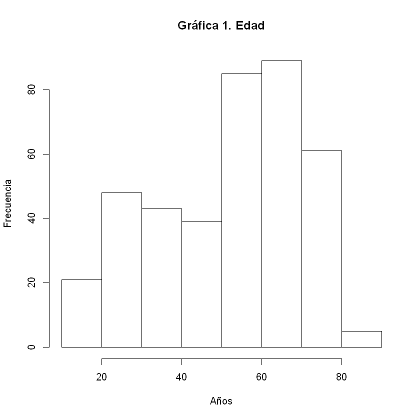
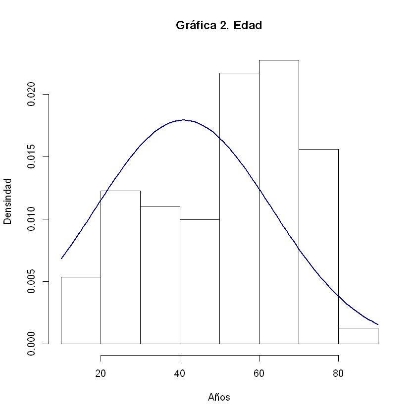
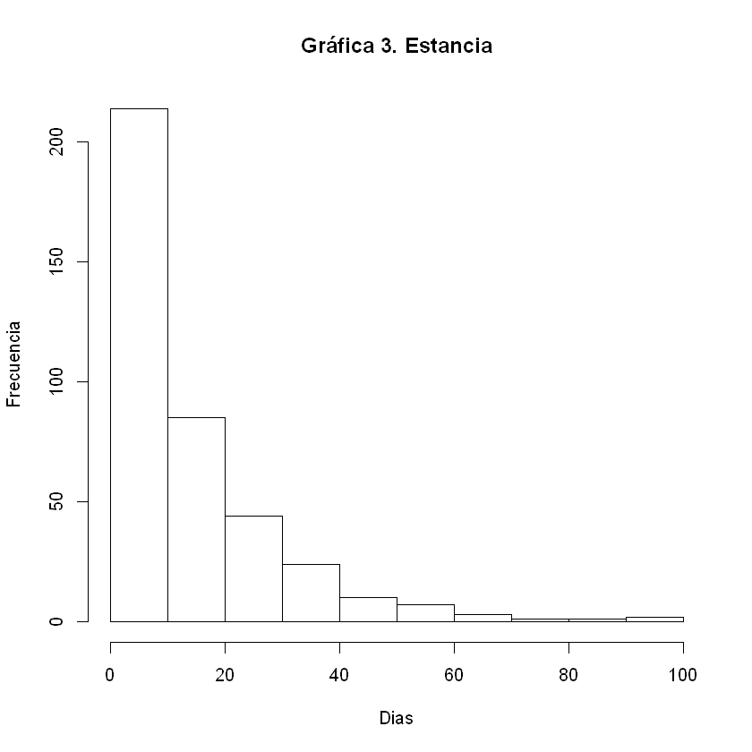
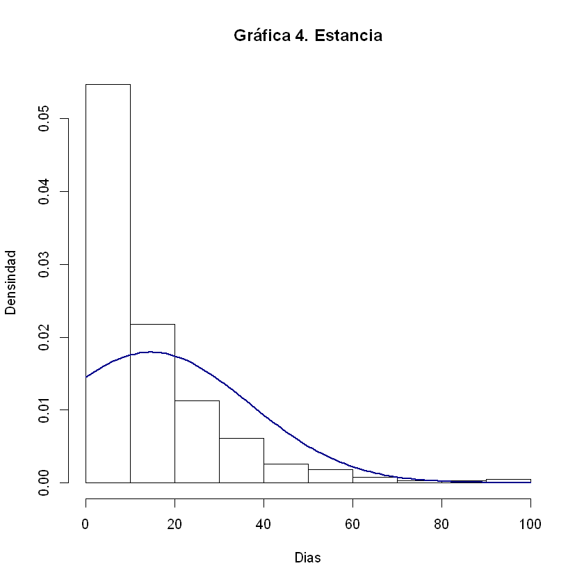
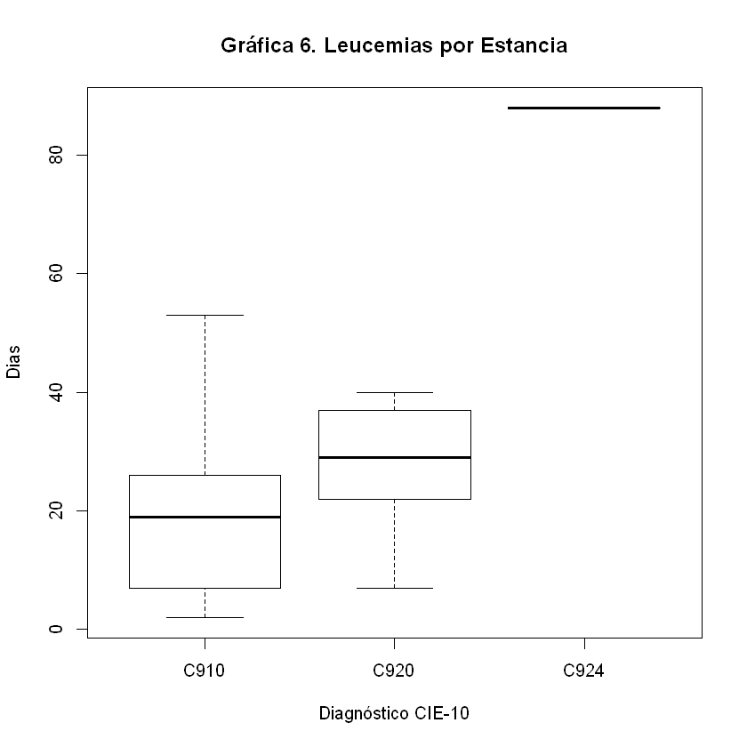
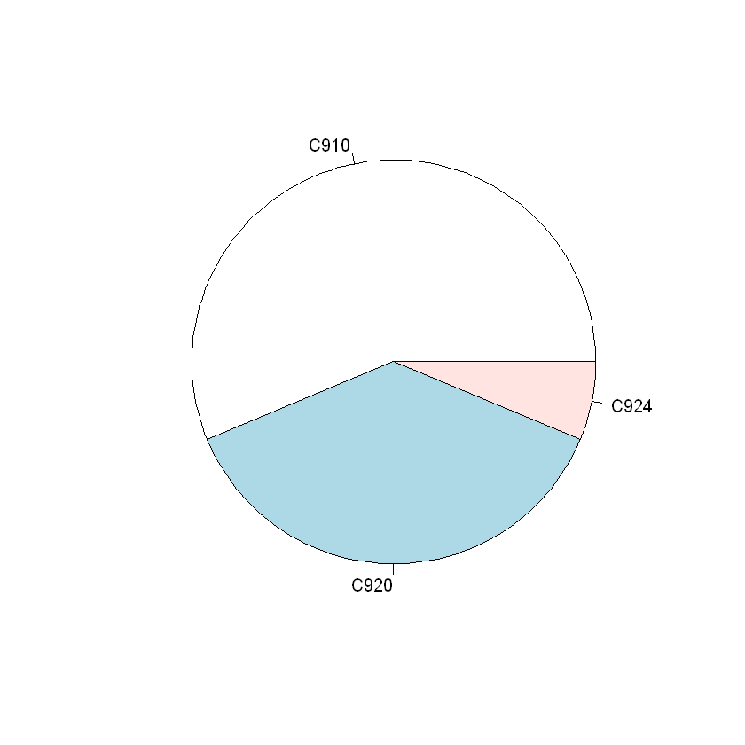

```R
install.packages("RcmdrMisc")
install.packages("googlesheets")
install.packages("dplyr")
library(googlesheets)
suppressMessages(library(dplyr))
```

    Installing package into 'C:/Users/manue/Documents/R/win-library/3.4'
    (as 'lib' is unspecified)
    

    package 'RcmdrMisc' successfully unpacked and MD5 sums checked
    
    The downloaded binary packages are in
    	C:\Users\manue\AppData\Local\Temp\RtmpeUBbBr\downloaded_packages
    

    Installing package into 'C:/Users/manue/Documents/R/win-library/3.4'
    (as 'lib' is unspecified)
    

    package 'googlesheets' successfully unpacked and MD5 sums checked
    
    The downloaded binary packages are in
    	C:\Users\manue\AppData\Local\Temp\RtmpeUBbBr\downloaded_packages
    

    Installing package into 'C:/Users/manue/Documents/R/win-library/3.4'
    (as 'lib' is unspecified)
    

    package 'dplyr' successfully unpacked and MD5 sums checked
    
    The downloaded binary packages are in
    	C:\Users\manue\AppData\Local\Temp\RtmpeUBbBr\downloaded_packages
    


```R
library(googlesheets)
suppressMessages(library(dplyr))
(my_sheets <- gs_ls())
```

    Auto-refreshing stale OAuth token.
    


<table>
<thead><tr><th scope=col>sheet_title</th><th scope=col>author</th><th scope=col>perm</th><th scope=col>version</th><th scope=col>updated</th><th scope=col>sheet_key</th><th scope=col>ws_feed</th><th scope=col>alternate</th><th scope=col>self</th><th scope=col>alt_key</th></tr></thead>
<tbody>
	<tr><td>HUSJ_2016_HHO                                                                                               </td><td>mfm5458                                                                                                     </td><td>rw                                                                                                          </td><td>new                                                                                                         </td><td>2019-03-29 02:37:15                                                                                         </td><td>1HIldKnrkQHXA_AvkoOX-FVpmiMgLgNu8Oxajfxu03Mk                                                                </td><td>https://spreadsheets.google.com/feeds/worksheets/1HIldKnrkQHXA_AvkoOX-FVpmiMgLgNu8Oxajfxu03Mk/private/full  </td><td>https://docs.google.com/spreadsheets/d/1HIldKnrkQHXA_AvkoOX-FVpmiMgLgNu8Oxajfxu03Mk/edit                    </td><td>https://spreadsheets.google.com/feeds/spreadsheets/private/full/1HIldKnrkQHXA_AvkoOX-FVpmiMgLgNu8Oxajfxu03Mk</td><td>NA                                                                                                          </td></tr>
	<tr><td>HUSJ_2018_HHO                                                                                               </td><td>mfm5458                                                                                                     </td><td>rw                                                                                                          </td><td>new                                                                                                         </td><td>2019-03-28 23:13:06                                                                                         </td><td>1ye-6zfsN8EhwZcgNkbvK6RKFkBxl5q4NxAel3sBX-cw                                                                </td><td>https://spreadsheets.google.com/feeds/worksheets/1ye-6zfsN8EhwZcgNkbvK6RKFkBxl5q4NxAel3sBX-cw/private/full  </td><td>https://docs.google.com/spreadsheets/d/1ye-6zfsN8EhwZcgNkbvK6RKFkBxl5q4NxAel3sBX-cw/edit                    </td><td>https://spreadsheets.google.com/feeds/spreadsheets/private/full/1ye-6zfsN8EhwZcgNkbvK6RKFkBxl5q4NxAel3sBX-cw</td><td>NA                                                                                                          </td></tr>
	<tr><td>HUSJ_2017_HHO                                                                                               </td><td>mfm5458                                                                                                     </td><td>rw                                                                                                          </td><td>new                                                                                                         </td><td>2019-03-28 23:08:37                                                                                         </td><td>1POI_c6ZdB_gFkZ9MEY9dut9Kvoj3ZZQach1Q0Gdh50A                                                                </td><td>https://spreadsheets.google.com/feeds/worksheets/1POI_c6ZdB_gFkZ9MEY9dut9Kvoj3ZZQach1Q0Gdh50A/private/full  </td><td>https://docs.google.com/spreadsheets/d/1POI_c6ZdB_gFkZ9MEY9dut9Kvoj3ZZQach1Q0Gdh50A/edit                    </td><td>https://spreadsheets.google.com/feeds/spreadsheets/private/full/1POI_c6ZdB_gFkZ9MEY9dut9Kvoj3ZZQach1Q0Gdh50A</td><td>NA                                                                                                          </td></tr>
	<tr><td>MORBILIDAD_FEBRERO_2016                                                                                     </td><td>mfm5458                                                                                                     </td><td>rw                                                                                                          </td><td>new                                                                                                         </td><td>2019-03-28 22:56:16                                                                                         </td><td>1SaqyVHLvUFC_JBiAI7gEjjttS5IUJ4csNYA8Bq_z4GQ                                                                </td><td>https://spreadsheets.google.com/feeds/worksheets/1SaqyVHLvUFC_JBiAI7gEjjttS5IUJ4csNYA8Bq_z4GQ/private/full  </td><td>https://docs.google.com/spreadsheets/d/1SaqyVHLvUFC_JBiAI7gEjjttS5IUJ4csNYA8Bq_z4GQ/edit                    </td><td>https://spreadsheets.google.com/feeds/spreadsheets/private/full/1SaqyVHLvUFC_JBiAI7gEjjttS5IUJ4csNYA8Bq_z4GQ</td><td>NA                                                                                                          </td></tr>
	<tr><td>MORBILIDAD_DICIEMBRE 2016                                                                                   </td><td>mfm5458                                                                                                     </td><td>rw                                                                                                          </td><td>new                                                                                                         </td><td>2019-03-28 22:53:51                                                                                         </td><td>1FuQwNhIa-Ry3UI4bue3fyMLCjYtlDtj8UmsM_Qv7AyM                                                                </td><td>https://spreadsheets.google.com/feeds/worksheets/1FuQwNhIa-Ry3UI4bue3fyMLCjYtlDtj8UmsM_Qv7AyM/private/full  </td><td>https://docs.google.com/spreadsheets/d/1FuQwNhIa-Ry3UI4bue3fyMLCjYtlDtj8UmsM_Qv7AyM/edit                    </td><td>https://spreadsheets.google.com/feeds/spreadsheets/private/full/1FuQwNhIa-Ry3UI4bue3fyMLCjYtlDtj8UmsM_Qv7AyM</td><td>NA                                                                                                          </td></tr>
	<tr><td>MORBILIDAD_NOVIEMBRE_2016                                                                                   </td><td>mfm5458                                                                                                     </td><td>rw                                                                                                          </td><td>new                                                                                                         </td><td>2019-03-28 22:45:51                                                                                         </td><td>1sQ9zB0a83h-Su0DZVsSo05gK85ag0ZIGV6emqd3Iozc                                                                </td><td>https://spreadsheets.google.com/feeds/worksheets/1sQ9zB0a83h-Su0DZVsSo05gK85ag0ZIGV6emqd3Iozc/private/full  </td><td>https://docs.google.com/spreadsheets/d/1sQ9zB0a83h-Su0DZVsSo05gK85ag0ZIGV6emqd3Iozc/edit                    </td><td>https://spreadsheets.google.com/feeds/spreadsheets/private/full/1sQ9zB0a83h-Su0DZVsSo05gK85ag0ZIGV6emqd3Iozc</td><td>NA                                                                                                          </td></tr>
	<tr><td>MORBILIDAD_OCTUBRE_2016                                                                                     </td><td>mfm5458                                                                                                     </td><td>rw                                                                                                          </td><td>new                                                                                                         </td><td>2019-03-28 22:32:33                                                                                         </td><td>1AOxKnq46ULz3lSy3aXBRH9amFn8TJ1kbVZ7cyQintp8                                                                </td><td>https://spreadsheets.google.com/feeds/worksheets/1AOxKnq46ULz3lSy3aXBRH9amFn8TJ1kbVZ7cyQintp8/private/full  </td><td>https://docs.google.com/spreadsheets/d/1AOxKnq46ULz3lSy3aXBRH9amFn8TJ1kbVZ7cyQintp8/edit                    </td><td>https://spreadsheets.google.com/feeds/spreadsheets/private/full/1AOxKnq46ULz3lSy3aXBRH9amFn8TJ1kbVZ7cyQintp8</td><td>NA                                                                                                          </td></tr>
	<tr><td>MORBILIDAD_SEPTIEMBRE_2016                                                                                  </td><td>mfm5458                                                                                                     </td><td>rw                                                                                                          </td><td>new                                                                                                         </td><td>2019-03-28 22:19:30                                                                                         </td><td>1a_OHq5d_a4a1bRfeolouWjyUWkWAhE3SzkZXfHTeNRA                                                                </td><td>https://spreadsheets.google.com/feeds/worksheets/1a_OHq5d_a4a1bRfeolouWjyUWkWAhE3SzkZXfHTeNRA/private/full  </td><td>https://docs.google.com/spreadsheets/d/1a_OHq5d_a4a1bRfeolouWjyUWkWAhE3SzkZXfHTeNRA/edit                    </td><td>https://spreadsheets.google.com/feeds/spreadsheets/private/full/1a_OHq5d_a4a1bRfeolouWjyUWkWAhE3SzkZXfHTeNRA</td><td>NA                                                                                                          </td></tr>
	<tr><td>MORBILIDAD_SEPTIEMBRE_2016                                                                                  </td><td>mfm5458                                                                                                     </td><td>rw                                                                                                          </td><td>new                                                                                                         </td><td>2019-03-28 22:15:45                                                                                         </td><td>15LoumG9nePggqs1VyTB5erJ0ZqDdqDDlIa6bF5PqQlg                                                                </td><td>https://spreadsheets.google.com/feeds/worksheets/15LoumG9nePggqs1VyTB5erJ0ZqDdqDDlIa6bF5PqQlg/private/full  </td><td>https://docs.google.com/spreadsheets/d/15LoumG9nePggqs1VyTB5erJ0ZqDdqDDlIa6bF5PqQlg/edit                    </td><td>https://spreadsheets.google.com/feeds/spreadsheets/private/full/15LoumG9nePggqs1VyTB5erJ0ZqDdqDDlIa6bF5PqQlg</td><td>NA                                                                                                          </td></tr>
	<tr><td>MORBILIDAD_AGOSTO_2016                                                                                      </td><td>mfm5458                                                                                                     </td><td>rw                                                                                                          </td><td>new                                                                                                         </td><td>2019-03-28 22:04:24                                                                                         </td><td>1McDeZQvHwRZ125vDIt7atM_lxBz1zrq6qAmldg3w0hA                                                                </td><td>https://spreadsheets.google.com/feeds/worksheets/1McDeZQvHwRZ125vDIt7atM_lxBz1zrq6qAmldg3w0hA/private/full  </td><td>https://docs.google.com/spreadsheets/d/1McDeZQvHwRZ125vDIt7atM_lxBz1zrq6qAmldg3w0hA/edit                    </td><td>https://spreadsheets.google.com/feeds/spreadsheets/private/full/1McDeZQvHwRZ125vDIt7atM_lxBz1zrq6qAmldg3w0hA</td><td>NA                                                                                                          </td></tr>
	<tr><td>MORBILIDAD_JULIO_2016                                                                                       </td><td>mfm5458                                                                                                     </td><td>rw                                                                                                          </td><td>new                                                                                                         </td><td>2019-03-28 21:40:57                                                                                         </td><td>1r8slHppLoRHINRKHXu_nIBGHm1yRwbfSgCyNcJ2jWGE                                                                </td><td>https://spreadsheets.google.com/feeds/worksheets/1r8slHppLoRHINRKHXu_nIBGHm1yRwbfSgCyNcJ2jWGE/private/full  </td><td>https://docs.google.com/spreadsheets/d/1r8slHppLoRHINRKHXu_nIBGHm1yRwbfSgCyNcJ2jWGE/edit                    </td><td>https://spreadsheets.google.com/feeds/spreadsheets/private/full/1r8slHppLoRHINRKHXu_nIBGHm1yRwbfSgCyNcJ2jWGE</td><td>NA                                                                                                          </td></tr>
	<tr><td>MORBILIDAD_JUNIO_2016                                                                                       </td><td>mfm5458                                                                                                     </td><td>rw                                                                                                          </td><td>new                                                                                                         </td><td>2019-03-28 21:37:16                                                                                         </td><td>1VJ51-ndzHZdnMA5wP5wNFdQD3Iuvfw5Pp6e9lzrWO0A                                                                </td><td>https://spreadsheets.google.com/feeds/worksheets/1VJ51-ndzHZdnMA5wP5wNFdQD3Iuvfw5Pp6e9lzrWO0A/private/full  </td><td>https://docs.google.com/spreadsheets/d/1VJ51-ndzHZdnMA5wP5wNFdQD3Iuvfw5Pp6e9lzrWO0A/edit                    </td><td>https://spreadsheets.google.com/feeds/spreadsheets/private/full/1VJ51-ndzHZdnMA5wP5wNFdQD3Iuvfw5Pp6e9lzrWO0A</td><td>NA                                                                                                          </td></tr>
	<tr><td>MORBILIDAD_MAYO_2016                                                                                        </td><td>mfm5458                                                                                                     </td><td>rw                                                                                                          </td><td>new                                                                                                         </td><td>2019-03-28 21:35:06                                                                                         </td><td>1VcwGfBvHsBT2Bx_tFIxdV34Hm_V3RCvP--rdFOEVzS8                                                                </td><td>https://spreadsheets.google.com/feeds/worksheets/1VcwGfBvHsBT2Bx_tFIxdV34Hm_V3RCvP--rdFOEVzS8/private/full  </td><td>https://docs.google.com/spreadsheets/d/1VcwGfBvHsBT2Bx_tFIxdV34Hm_V3RCvP--rdFOEVzS8/edit                    </td><td>https://spreadsheets.google.com/feeds/spreadsheets/private/full/1VcwGfBvHsBT2Bx_tFIxdV34Hm_V3RCvP--rdFOEVzS8</td><td>NA                                                                                                          </td></tr>
	<tr><td>MORBILIDAD ABRIL 2016                                                                                       </td><td>mfm5458                                                                                                     </td><td>rw                                                                                                          </td><td>new                                                                                                         </td><td>2019-03-28 21:25:59                                                                                         </td><td>1Oa-5OyF2-7CulCfy3sB7JqHyq_Q1BWiE4mWXE_CG-qk                                                                </td><td>https://spreadsheets.google.com/feeds/worksheets/1Oa-5OyF2-7CulCfy3sB7JqHyq_Q1BWiE4mWXE_CG-qk/private/full  </td><td>https://docs.google.com/spreadsheets/d/1Oa-5OyF2-7CulCfy3sB7JqHyq_Q1BWiE4mWXE_CG-qk/edit                    </td><td>https://spreadsheets.google.com/feeds/spreadsheets/private/full/1Oa-5OyF2-7CulCfy3sB7JqHyq_Q1BWiE4mWXE_CG-qk</td><td>NA                                                                                                          </td></tr>
	<tr><td>MORBILIDAD_MARZO_2016                                                                                       </td><td>mfm5458                                                                                                     </td><td>rw                                                                                                          </td><td>new                                                                                                         </td><td>2019-03-28 21:22:47                                                                                         </td><td>1xBKq34sfOw2dr7yRhGAWH-S4C3fAEvguuW8mOeYFv9I                                                                </td><td>https://spreadsheets.google.com/feeds/worksheets/1xBKq34sfOw2dr7yRhGAWH-S4C3fAEvguuW8mOeYFv9I/private/full  </td><td>https://docs.google.com/spreadsheets/d/1xBKq34sfOw2dr7yRhGAWH-S4C3fAEvguuW8mOeYFv9I/edit                    </td><td>https://spreadsheets.google.com/feeds/spreadsheets/private/full/1xBKq34sfOw2dr7yRhGAWH-S4C3fAEvguuW8mOeYFv9I</td><td>NA                                                                                                          </td></tr>
	<tr><td>MORBILIDAD_ENERO_2016                                                                                       </td><td>mfm5458                                                                                                     </td><td>rw                                                                                                          </td><td>new                                                                                                         </td><td>2019-03-28 21:13:47                                                                                         </td><td>1UDc63YkwQ2_MzRz4heHdTDfngEfLnGL17CqjjqFqCuc                                                                </td><td>https://spreadsheets.google.com/feeds/worksheets/1UDc63YkwQ2_MzRz4heHdTDfngEfLnGL17CqjjqFqCuc/private/full  </td><td>https://docs.google.com/spreadsheets/d/1UDc63YkwQ2_MzRz4heHdTDfngEfLnGL17CqjjqFqCuc/edit                    </td><td>https://spreadsheets.google.com/feeds/spreadsheets/private/full/1UDc63YkwQ2_MzRz4heHdTDfngEfLnGL17CqjjqFqCuc</td><td>NA                                                                                                          </td></tr>
	<tr><td>Hoja de cálculo sin título                                                                                  </td><td>mfm5458                                                                                                     </td><td>rw                                                                                                          </td><td>new                                                                                                         </td><td>2019-03-15 03:59:28                                                                                         </td><td>1np-OTsON-nFSIza1lPMiVPjiWeoIZS8GgB7RQUhe7UQ                                                                </td><td>https://spreadsheets.google.com/feeds/worksheets/1np-OTsON-nFSIza1lPMiVPjiWeoIZS8GgB7RQUhe7UQ/private/full  </td><td>https://docs.google.com/spreadsheets/d/1np-OTsON-nFSIza1lPMiVPjiWeoIZS8GgB7RQUhe7UQ/edit                    </td><td>https://spreadsheets.google.com/feeds/spreadsheets/private/full/1np-OTsON-nFSIza1lPMiVPjiWeoIZS8GgB7RQUhe7UQ</td><td>NA                                                                                                          </td></tr>
	<tr><td>CRPWBCSx                                                                                                    </td><td>mfm5458                                                                                                     </td><td>rw                                                                                                          </td><td>new                                                                                                         </td><td>2019-03-15 03:46:31                                                                                         </td><td>1w_jpMpLKyO0PFpJyZWuyuER-PR7EwygZZqrb8ZV7GhY                                                                </td><td>https://spreadsheets.google.com/feeds/worksheets/1w_jpMpLKyO0PFpJyZWuyuER-PR7EwygZZqrb8ZV7GhY/private/full  </td><td>https://docs.google.com/spreadsheets/d/1w_jpMpLKyO0PFpJyZWuyuER-PR7EwygZZqrb8ZV7GhY/edit                    </td><td>https://spreadsheets.google.com/feeds/spreadsheets/private/full/1w_jpMpLKyO0PFpJyZWuyuER-PR7EwygZZqrb8ZV7GhY</td><td>NA                                                                                                          </td></tr>
	<tr><td>salidaRUSSELL                                                                                               </td><td>mfm5458                                                                                                     </td><td>rw                                                                                                          </td><td>new                                                                                                         </td><td>2019-03-09 23:30:34                                                                                         </td><td>1x7uOk9DJ287QrgUZ9VBRmOBSp_YERI3o3_nd4khwB6U                                                                </td><td>https://spreadsheets.google.com/feeds/worksheets/1x7uOk9DJ287QrgUZ9VBRmOBSp_YERI3o3_nd4khwB6U/private/full  </td><td>https://docs.google.com/spreadsheets/d/1x7uOk9DJ287QrgUZ9VBRmOBSp_YERI3o3_nd4khwB6U/edit                    </td><td>https://spreadsheets.google.com/feeds/spreadsheets/private/full/1x7uOk9DJ287QrgUZ9VBRmOBSp_YERI3o3_nd4khwB6U</td><td>NA                                                                                                          </td></tr>
	<tr><td>Reporte de Ronda (AMO FEBRERO)                                                                              </td><td>mfm5458                                                                                                     </td><td>rw                                                                                                          </td><td>new                                                                                                         </td><td>2019-03-04 21:54:58                                                                                         </td><td>1GGYMeKVCmtWU9U8jEU2U036cX-n8mic_tcerE3EuOQs                                                                </td><td>https://spreadsheets.google.com/feeds/worksheets/1GGYMeKVCmtWU9U8jEU2U036cX-n8mic_tcerE3EuOQs/private/full  </td><td>https://docs.google.com/spreadsheets/d/1GGYMeKVCmtWU9U8jEU2U036cX-n8mic_tcerE3EuOQs/edit                    </td><td>https://spreadsheets.google.com/feeds/spreadsheets/private/full/1GGYMeKVCmtWU9U8jEU2U036cX-n8mic_tcerE3EuOQs</td><td>NA                                                                                                          </td></tr>
	<tr><td>Reporte de Ronda (PL+IT)                                                                                    </td><td>mfm5458                                                                                                     </td><td>rw                                                                                                          </td><td>new                                                                                                         </td><td>2019-03-04 21:53:30                                                                                         </td><td>1ByepzTyRIQCq_mEN2D6fqRjywd6U6Y-ZNAuUXHRns34                                                                </td><td>https://spreadsheets.google.com/feeds/worksheets/1ByepzTyRIQCq_mEN2D6fqRjywd6U6Y-ZNAuUXHRns34/private/full  </td><td>https://docs.google.com/spreadsheets/d/1ByepzTyRIQCq_mEN2D6fqRjywd6U6Y-ZNAuUXHRns34/edit                    </td><td>https://spreadsheets.google.com/feeds/spreadsheets/private/full/1ByepzTyRIQCq_mEN2D6fqRjywd6U6Y-ZNAuUXHRns34</td><td>NA                                                                                                          </td></tr>
	<tr><td>Reporte de Ronda (MONOQUIMIOTERAPIA FEBRERO)                                                                </td><td>mfm5458                                                                                                     </td><td>rw                                                                                                          </td><td>new                                                                                                         </td><td>2019-03-04 21:48:26                                                                                         </td><td>1lbIIbjMHWTyzRNxliYkh3CExSiHkTVv0WF2Xm8JSm6U                                                                </td><td>https://spreadsheets.google.com/feeds/worksheets/1lbIIbjMHWTyzRNxliYkh3CExSiHkTVv0WF2Xm8JSm6U/private/full  </td><td>https://docs.google.com/spreadsheets/d/1lbIIbjMHWTyzRNxliYkh3CExSiHkTVv0WF2Xm8JSm6U/edit                    </td><td>https://spreadsheets.google.com/feeds/spreadsheets/private/full/1lbIIbjMHWTyzRNxliYkh3CExSiHkTVv0WF2Xm8JSm6U</td><td>NA                                                                                                          </td></tr>
	<tr><td>Reporte de Ronda (POLIQUIMIOTERAPIA FEBRERO)                                                                </td><td>mfm5458                                                                                                     </td><td>rw                                                                                                          </td><td>new                                                                                                         </td><td>2019-03-04 21:42:12                                                                                         </td><td>1FxVCYIgfZKwiNzw8pu-7KiC8H8tK1iH-GWu8iKP34mw                                                                </td><td>https://spreadsheets.google.com/feeds/worksheets/1FxVCYIgfZKwiNzw8pu-7KiC8H8tK1iH-GWu8iKP34mw/private/full  </td><td>https://docs.google.com/spreadsheets/d/1FxVCYIgfZKwiNzw8pu-7KiC8H8tK1iH-GWu8iKP34mw/edit                    </td><td>https://spreadsheets.google.com/feeds/spreadsheets/private/full/1FxVCYIgfZKwiNzw8pu-7KiC8H8tK1iH-GWu8iKP34mw</td><td>NA                                                                                                          </td></tr>
	<tr><td>Reporte de Ronda (TODO FEBRERO)                                                                             </td><td>mfm5458                                                                                                     </td><td>rw                                                                                                          </td><td>new                                                                                                         </td><td>2019-03-04 21:38:53                                                                                         </td><td>15oZR5Q2MKti13EEHZ8SYRzXW6eTR0dHJfkSwiudCkYY                                                                </td><td>https://spreadsheets.google.com/feeds/worksheets/15oZR5Q2MKti13EEHZ8SYRzXW6eTR0dHJfkSwiudCkYY/private/full  </td><td>https://docs.google.com/spreadsheets/d/15oZR5Q2MKti13EEHZ8SYRzXW6eTR0dHJfkSwiudCkYY/edit                    </td><td>https://spreadsheets.google.com/feeds/spreadsheets/private/full/15oZR5Q2MKti13EEHZ8SYRzXW6eTR0dHJfkSwiudCkYY</td><td>NA                                                                                                          </td></tr>
	<tr><td>DDW                                                                                                         </td><td>mfm5458                                                                                                     </td><td>rw                                                                                                          </td><td>new                                                                                                         </td><td>2019-02-17 20:51:39                                                                                         </td><td>1dMiZTwIhDDPynPAwYeEabgKMCKe0hfhzdAAVDKVX7HI                                                                </td><td>https://spreadsheets.google.com/feeds/worksheets/1dMiZTwIhDDPynPAwYeEabgKMCKe0hfhzdAAVDKVX7HI/private/full  </td><td>https://docs.google.com/spreadsheets/d/1dMiZTwIhDDPynPAwYeEabgKMCKe0hfhzdAAVDKVX7HI/edit                    </td><td>https://spreadsheets.google.com/feeds/spreadsheets/private/full/1dMiZTwIhDDPynPAwYeEabgKMCKe0hfhzdAAVDKVX7HI</td><td>NA                                                                                                          </td></tr>
	<tr><td>Reporte de Ronda (ENERO 29)                                                                                 </td><td>mfm5458                                                                                                     </td><td>rw                                                                                                          </td><td>new                                                                                                         </td><td>2019-02-17 13:37:29                                                                                         </td><td>14Dc-Lc5_AwQXPBVM7BIuhV0lPHz4yVyl0d_OZArArNE                                                                </td><td>https://spreadsheets.google.com/feeds/worksheets/14Dc-Lc5_AwQXPBVM7BIuhV0lPHz4yVyl0d_OZArArNE/private/full  </td><td>https://docs.google.com/spreadsheets/d/14Dc-Lc5_AwQXPBVM7BIuhV0lPHz4yVyl0d_OZArArNE/edit                    </td><td>https://spreadsheets.google.com/feeds/spreadsheets/private/full/14Dc-Lc5_AwQXPBVM7BIuhV0lPHz4yVyl0d_OZArArNE</td><td>NA                                                                                                          </td></tr>
	<tr><td>CCX                                                                                                         </td><td>mfm5458                                                                                                     </td><td>rw                                                                                                          </td><td>new                                                                                                         </td><td>2019-02-15 21:59:14                                                                                         </td><td>1QRJOP6m_EQPlsyGK9HvATPns2iqyIW4DH86Y1cEUbuY                                                                </td><td>https://spreadsheets.google.com/feeds/worksheets/1QRJOP6m_EQPlsyGK9HvATPns2iqyIW4DH86Y1cEUbuY/private/full  </td><td>https://docs.google.com/spreadsheets/d/1QRJOP6m_EQPlsyGK9HvATPns2iqyIW4DH86Y1cEUbuY/edit                    </td><td>https://spreadsheets.google.com/feeds/spreadsheets/private/full/1QRJOP6m_EQPlsyGK9HvATPns2iqyIW4DH86Y1cEUbuY</td><td>NA                                                                                                          </td></tr>
	<tr><td>Reporte de Ronda AMO                                                                                        </td><td>mfm5458                                                                                                     </td><td>rw                                                                                                          </td><td>new                                                                                                         </td><td>2019-02-05 23:58:25                                                                                         </td><td>1VB3i9JsXTD4BMwFLS3DHHtKA7ELrPsoLb2VsyNyw97U                                                                </td><td>https://spreadsheets.google.com/feeds/worksheets/1VB3i9JsXTD4BMwFLS3DHHtKA7ELrPsoLb2VsyNyw97U/private/full  </td><td>https://docs.google.com/spreadsheets/d/1VB3i9JsXTD4BMwFLS3DHHtKA7ELrPsoLb2VsyNyw97U/edit                    </td><td>https://spreadsheets.google.com/feeds/spreadsheets/private/full/1VB3i9JsXTD4BMwFLS3DHHtKA7ELrPsoLb2VsyNyw97U</td><td>NA                                                                                                          </td></tr>
	<tr><td>Reporte de Ronda QUIMIOTERAPIA                                                                              </td><td>mfm5458                                                                                                     </td><td>rw                                                                                                          </td><td>new                                                                                                         </td><td>2019-02-05 23:58:15                                                                                         </td><td>1DsFtzMMJwaaJSJGnYod3h4273wzCjLz6RelMuP5tzIs                                                                </td><td>https://spreadsheets.google.com/feeds/worksheets/1DsFtzMMJwaaJSJGnYod3h4273wzCjLz6RelMuP5tzIs/private/full  </td><td>https://docs.google.com/spreadsheets/d/1DsFtzMMJwaaJSJGnYod3h4273wzCjLz6RelMuP5tzIs/edit                    </td><td>https://spreadsheets.google.com/feeds/spreadsheets/private/full/1DsFtzMMJwaaJSJGnYod3h4273wzCjLz6RelMuP5tzIs</td><td>NA                                                                                                          </td></tr>
	<tr><td>Reporte de Ronda 31-02-19                                                                                   </td><td>mfm5458                                                                                                     </td><td>rw                                                                                                          </td><td>new                                                                                                         </td><td>2019-02-05 23:47:27                                                                                         </td><td>1ueN3hk0B7fH9V7bn-aVhV7el-3YqJ-fBPAQNVBy4UY4                                                                </td><td>https://spreadsheets.google.com/feeds/worksheets/1ueN3hk0B7fH9V7bn-aVhV7el-3YqJ-fBPAQNVBy4UY4/private/full  </td><td>https://docs.google.com/spreadsheets/d/1ueN3hk0B7fH9V7bn-aVhV7el-3YqJ-fBPAQNVBy4UY4/edit                    </td><td>https://spreadsheets.google.com/feeds/spreadsheets/private/full/1ueN3hk0B7fH9V7bn-aVhV7el-3YqJ-fBPAQNVBy4UY4</td><td>NA                                                                                                          </td></tr>
	<tr><td>...</td><td>...</td><td>...</td><td>...</td><td>...</td><td>...</td><td>...</td><td>...</td><td>...</td><td>...</td></tr>
	<tr><td>HEMATOLOGIA                                                                                                 </td><td>mfm5458                                                                                                     </td><td>rw                                                                                                          </td><td>new                                                                                                         </td><td>2018-07-29 05:25:06                                                                                         </td><td>14o4uwRoInQe7LUMqtZwNp44oHTz20Z4MBePUC-Wb-mg                                                                </td><td>https://spreadsheets.google.com/feeds/worksheets/14o4uwRoInQe7LUMqtZwNp44oHTz20Z4MBePUC-Wb-mg/private/full  </td><td>https://docs.google.com/spreadsheets/d/14o4uwRoInQe7LUMqtZwNp44oHTz20Z4MBePUC-Wb-mg/edit                    </td><td>https://spreadsheets.google.com/feeds/spreadsheets/private/full/14o4uwRoInQe7LUMqtZwNp44oHTz20Z4MBePUC-Wb-mg</td><td>NA                                                                                                          </td></tr>
	<tr><td>Gapminder                                                                                                   </td><td>mfm5458                                                                                                     </td><td>rw                                                                                                          </td><td>new                                                                                                         </td><td>2018-07-29 03:51:34                                                                                         </td><td>1aVpzqDxAaRrYiwddwI4SpV9XsFvlksa2TAobbYh2K5Y                                                                </td><td>https://spreadsheets.google.com/feeds/worksheets/1aVpzqDxAaRrYiwddwI4SpV9XsFvlksa2TAobbYh2K5Y/private/full  </td><td>https://docs.google.com/spreadsheets/d/1aVpzqDxAaRrYiwddwI4SpV9XsFvlksa2TAobbYh2K5Y/edit                    </td><td>https://spreadsheets.google.com/feeds/spreadsheets/private/full/1aVpzqDxAaRrYiwddwI4SpV9XsFvlksa2TAobbYh2K5Y</td><td>NA                                                                                                          </td></tr>
	<tr><td>HEMATOL                                                                                                     </td><td>mfm5458                                                                                                     </td><td>rw                                                                                                          </td><td>new                                                                                                         </td><td>2018-07-29 03:33:00                                                                                         </td><td>1QSQWSuYkJ4SdsQDhePMtMJNYrMs9Xl2Ihum5FIcDrk8                                                                </td><td>https://spreadsheets.google.com/feeds/worksheets/1QSQWSuYkJ4SdsQDhePMtMJNYrMs9Xl2Ihum5FIcDrk8/private/full  </td><td>https://docs.google.com/spreadsheets/d/1QSQWSuYkJ4SdsQDhePMtMJNYrMs9Xl2Ihum5FIcDrk8/edit                    </td><td>https://spreadsheets.google.com/feeds/spreadsheets/private/full/1QSQWSuYkJ4SdsQDhePMtMJNYrMs9Xl2Ihum5FIcDrk8</td><td>NA                                                                                                          </td></tr>
	<tr><td>LIGA 27 DE JULIO 2018                                                                                       </td><td>mfm5458                                                                                                     </td><td>rw                                                                                                          </td><td>new                                                                                                         </td><td>2018-07-27 20:29:54                                                                                         </td><td>1sbdYvRqZXFJMX68euQMjxyi5VK_kfEIhVk7SN5jOCeI                                                                </td><td>https://spreadsheets.google.com/feeds/worksheets/1sbdYvRqZXFJMX68euQMjxyi5VK_kfEIhVk7SN5jOCeI/private/full  </td><td>https://docs.google.com/spreadsheets/d/1sbdYvRqZXFJMX68euQMjxyi5VK_kfEIhVk7SN5jOCeI/edit                    </td><td>https://spreadsheets.google.com/feeds/spreadsheets/private/full/1sbdYvRqZXFJMX68euQMjxyi5VK_kfEIhVk7SN5jOCeI</td><td>NA                                                                                                          </td></tr>
	<tr><td>LIGA 24 DE JULIO 2018                                                                                       </td><td>mfm5458                                                                                                     </td><td>rw                                                                                                          </td><td>new                                                                                                         </td><td>2018-07-25 17:56:17                                                                                         </td><td>1Ny0nRNEl6rfOCpescKJkwKt8pbhzMicFkK6yl4_DUKY                                                                </td><td>https://spreadsheets.google.com/feeds/worksheets/1Ny0nRNEl6rfOCpescKJkwKt8pbhzMicFkK6yl4_DUKY/private/full  </td><td>https://docs.google.com/spreadsheets/d/1Ny0nRNEl6rfOCpescKJkwKt8pbhzMicFkK6yl4_DUKY/edit                    </td><td>https://spreadsheets.google.com/feeds/spreadsheets/private/full/1Ny0nRNEl6rfOCpescKJkwKt8pbhzMicFkK6yl4_DUKY</td><td>NA                                                                                                          </td></tr>
	<tr><td>Panacea Data                                                                                                </td><td>mfm5458                                                                                                     </td><td>rw                                                                                                          </td><td>new                                                                                                         </td><td>2018-07-25 03:15:31                                                                                         </td><td>1pVDDiSyeBPi4m5V1WijDYzrFiu_ImqqituH6gNQO7-E                                                                </td><td>https://spreadsheets.google.com/feeds/worksheets/1pVDDiSyeBPi4m5V1WijDYzrFiu_ImqqituH6gNQO7-E/private/full  </td><td>https://docs.google.com/spreadsheets/d/1pVDDiSyeBPi4m5V1WijDYzrFiu_ImqqituH6gNQO7-E/edit                    </td><td>https://spreadsheets.google.com/feeds/spreadsheets/private/full/1pVDDiSyeBPi4m5V1WijDYzrFiu_ImqqituH6gNQO7-E</td><td>NA                                                                                                          </td></tr>
	<tr><td>LIGA 20 DE JULIO 2018                                                                                       </td><td>mfm5458                                                                                                     </td><td>rw                                                                                                          </td><td>new                                                                                                         </td><td>2018-07-20 19:31:30                                                                                         </td><td>1fCCl0ISJP4IuuL0nEJ1bwomopBWhj6WQgg7_-gdv87A                                                                </td><td>https://spreadsheets.google.com/feeds/worksheets/1fCCl0ISJP4IuuL0nEJ1bwomopBWhj6WQgg7_-gdv87A/private/full  </td><td>https://docs.google.com/spreadsheets/d/1fCCl0ISJP4IuuL0nEJ1bwomopBWhj6WQgg7_-gdv87A/edit                    </td><td>https://spreadsheets.google.com/feeds/spreadsheets/private/full/1fCCl0ISJP4IuuL0nEJ1bwomopBWhj6WQgg7_-gdv87A</td><td>NA                                                                                                          </td></tr>
	<tr><td>Plantilla Hematologia Oncologia v3.xlsm                                                                     </td><td>mfm5458                                                                                                     </td><td>rw                                                                                                          </td><td>new                                                                                                         </td><td>2018-07-19 05:06:50                                                                                         </td><td>1UqPWX5I6oCPakGarjpTZs8FjY8Eau8_TS6bUnBp-z2I                                                                </td><td>https://spreadsheets.google.com/feeds/worksheets/1UqPWX5I6oCPakGarjpTZs8FjY8Eau8_TS6bUnBp-z2I/private/full  </td><td>https://docs.google.com/spreadsheets/d/1UqPWX5I6oCPakGarjpTZs8FjY8Eau8_TS6bUnBp-z2I/edit                    </td><td>https://spreadsheets.google.com/feeds/spreadsheets/private/full/1UqPWX5I6oCPakGarjpTZs8FjY8Eau8_TS6bUnBp-z2I</td><td>NA                                                                                                          </td></tr>
	<tr><td>Hoja de cálculo sin título                                                                                  </td><td>mfm5458                                                                                                     </td><td>rw                                                                                                          </td><td>new                                                                                                         </td><td>2018-07-19 04:37:22                                                                                         </td><td>1NMl0UOPrmugFdm8GHq0SmOiwVsiYoyQmVTFAQgNXolU                                                                </td><td>https://spreadsheets.google.com/feeds/worksheets/1NMl0UOPrmugFdm8GHq0SmOiwVsiYoyQmVTFAQgNXolU/private/full  </td><td>https://docs.google.com/spreadsheets/d/1NMl0UOPrmugFdm8GHq0SmOiwVsiYoyQmVTFAQgNXolU/edit                    </td><td>https://spreadsheets.google.com/feeds/spreadsheets/private/full/1NMl0UOPrmugFdm8GHq0SmOiwVsiYoyQmVTFAQgNXolU</td><td>NA                                                                                                          </td></tr>
	<tr><td>Hoja de cálculo sin título                                                                                  </td><td>mfm5458                                                                                                     </td><td>rw                                                                                                          </td><td>new                                                                                                         </td><td>2018-07-17 01:01:39                                                                                         </td><td>1EHRbToOcDhhhbvJGDJVO2jtP5usZMJaQd-ZGY-afK_0                                                                </td><td>https://spreadsheets.google.com/feeds/worksheets/1EHRbToOcDhhhbvJGDJVO2jtP5usZMJaQd-ZGY-afK_0/private/full  </td><td>https://docs.google.com/spreadsheets/d/1EHRbToOcDhhhbvJGDJVO2jtP5usZMJaQd-ZGY-afK_0/edit                    </td><td>https://spreadsheets.google.com/feeds/spreadsheets/private/full/1EHRbToOcDhhhbvJGDJVO2jtP5usZMJaQd-ZGY-afK_0</td><td>NA                                                                                                          </td></tr>
	<tr><td>LIGA 15 DE JULIO 2018.xls                                                                                   </td><td>mfm5458                                                                                                     </td><td>rw                                                                                                          </td><td>new                                                                                                         </td><td>2018-07-16 12:26:25                                                                                         </td><td>13-0PA7q5O88fBnIDk449InQVoX95f-1U45i6RlkFrpY                                                                </td><td>https://spreadsheets.google.com/feeds/worksheets/13-0PA7q5O88fBnIDk449InQVoX95f-1U45i6RlkFrpY/private/full  </td><td>https://docs.google.com/spreadsheets/d/13-0PA7q5O88fBnIDk449InQVoX95f-1U45i6RlkFrpY/edit                    </td><td>https://spreadsheets.google.com/feeds/spreadsheets/private/full/13-0PA7q5O88fBnIDk449InQVoX95f-1U45i6RlkFrpY</td><td>NA                                                                                                          </td></tr>
	<tr><td>LIGA 10 DE JULIO 2018.ods                                                                                   </td><td>mfm5458                                                                                                     </td><td>rw                                                                                                          </td><td>new                                                                                                         </td><td>2018-07-11 12:07:47                                                                                         </td><td>1ci8ac8s1LnFIxuJ3JOQyg5ZDexEr6Pi7JxjU3mnlpGA                                                                </td><td>https://spreadsheets.google.com/feeds/worksheets/1ci8ac8s1LnFIxuJ3JOQyg5ZDexEr6Pi7JxjU3mnlpGA/private/full  </td><td>https://docs.google.com/spreadsheets/d/1ci8ac8s1LnFIxuJ3JOQyg5ZDexEr6Pi7JxjU3mnlpGA/edit                    </td><td>https://spreadsheets.google.com/feeds/spreadsheets/private/full/1ci8ac8s1LnFIxuJ3JOQyg5ZDexEr6Pi7JxjU3mnlpGA</td><td>NA                                                                                                          </td></tr>
	<tr><td>Prueba de conmutación                                                                                       </td><td>mfm5458                                                                                                     </td><td>rw                                                                                                          </td><td>new                                                                                                         </td><td>2018-07-10 21:37:49                                                                                         </td><td>1CsJjq8MNjbkm1vV4xAGDzQlK3MPNyYfGt9K97OQTcsU                                                                </td><td>https://spreadsheets.google.com/feeds/worksheets/1CsJjq8MNjbkm1vV4xAGDzQlK3MPNyYfGt9K97OQTcsU/private/full  </td><td>https://docs.google.com/spreadsheets/d/1CsJjq8MNjbkm1vV4xAGDzQlK3MPNyYfGt9K97OQTcsU/edit                    </td><td>https://spreadsheets.google.com/feeds/spreadsheets/private/full/1CsJjq8MNjbkm1vV4xAGDzQlK3MPNyYfGt9K97OQTcsU</td><td>NA                                                                                                          </td></tr>
	<tr><td>LIGA(06/07/2018).xlsx                                                                                       </td><td>mfm5458                                                                                                     </td><td>rw                                                                                                          </td><td>new                                                                                                         </td><td>2018-07-09 22:46:58                                                                                         </td><td>1o6oDVQtyv_GpTMx8XtPpLV-zRQVhoynlmToVcrelwKc                                                                </td><td>https://spreadsheets.google.com/feeds/worksheets/1o6oDVQtyv_GpTMx8XtPpLV-zRQVhoynlmToVcrelwKc/private/full  </td><td>https://docs.google.com/spreadsheets/d/1o6oDVQtyv_GpTMx8XtPpLV-zRQVhoynlmToVcrelwKc/edit                    </td><td>https://spreadsheets.google.com/feeds/spreadsheets/private/full/1o6oDVQtyv_GpTMx8XtPpLV-zRQVhoynlmToVcrelwKc</td><td>NA                                                                                                          </td></tr>
	<tr><td>Hoja de cálculo sin título                                                                                  </td><td>mfm5458                                                                                                     </td><td>rw                                                                                                          </td><td>new                                                                                                         </td><td>2018-07-05 00:08:52                                                                                         </td><td>1CpLkdim0CBnc-TcguqnGVI8HORJc50iGd-_D0TvCGMY                                                                </td><td>https://spreadsheets.google.com/feeds/worksheets/1CpLkdim0CBnc-TcguqnGVI8HORJc50iGd-_D0TvCGMY/private/full  </td><td>https://docs.google.com/spreadsheets/d/1CpLkdim0CBnc-TcguqnGVI8HORJc50iGd-_D0TvCGMY/edit                    </td><td>https://spreadsheets.google.com/feeds/spreadsheets/private/full/1CpLkdim0CBnc-TcguqnGVI8HORJc50iGd-_D0TvCGMY</td><td>NA                                                                                                          </td></tr>
	<tr><td>Hoja de cálculo sin título                                                                                  </td><td>mfm5458                                                                                                     </td><td>rw                                                                                                          </td><td>new                                                                                                         </td><td>2018-07-04 17:27:13                                                                                         </td><td>1Di7ddmc5YUR6MU2vQtAP6pV80v6m2CxwfhJUp8ZWshA                                                                </td><td>https://spreadsheets.google.com/feeds/worksheets/1Di7ddmc5YUR6MU2vQtAP6pV80v6m2CxwfhJUp8ZWshA/private/full  </td><td>https://docs.google.com/spreadsheets/d/1Di7ddmc5YUR6MU2vQtAP6pV80v6m2CxwfhJUp8ZWshA/edit                    </td><td>https://spreadsheets.google.com/feeds/spreadsheets/private/full/1Di7ddmc5YUR6MU2vQtAP6pV80v6m2CxwfhJUp8ZWshA</td><td>NA                                                                                                          </td></tr>
	<tr><td>IOE: SIMULACIÓN. Temas a Exponer (Responses)                                                                </td><td>jptabaresv                                                                                                  </td><td>r                                                                                                           </td><td>new                                                                                                         </td><td>2018-05-18 23:20:45                                                                                         </td><td>1fw8MlptbUgVWfTryKmS_5mkpM7uFTQcFNEXMndPWc-g                                                                </td><td>https://spreadsheets.google.com/feeds/worksheets/1fw8MlptbUgVWfTryKmS_5mkpM7uFTQcFNEXMndPWc-g/private/values</td><td>https://docs.google.com/spreadsheets/d/1fw8MlptbUgVWfTryKmS_5mkpM7uFTQcFNEXMndPWc-g/edit                    </td><td>https://spreadsheets.google.com/feeds/spreadsheets/private/full/1fw8MlptbUgVWfTryKmS_5mkpM7uFTQcFNEXMndPWc-g</td><td>NA                                                                                                          </td></tr>
	<tr><td>app                                                                                                         </td><td>mfm5458                                                                                                     </td><td>rw                                                                                                          </td><td>new                                                                                                         </td><td>2017-06-09 01:04:32                                                                                         </td><td>1orkq2JEVqu-85YLUmWh3OV4c94IneyhhmjjlgL0opww                                                                </td><td>https://spreadsheets.google.com/feeds/worksheets/1orkq2JEVqu-85YLUmWh3OV4c94IneyhhmjjlgL0opww/private/full  </td><td>https://docs.google.com/spreadsheets/d/1orkq2JEVqu-85YLUmWh3OV4c94IneyhhmjjlgL0opww/edit                    </td><td>https://spreadsheets.google.com/feeds/spreadsheets/private/full/1orkq2JEVqu-85YLUmWh3OV4c94IneyhhmjjlgL0opww</td><td>NA                                                                                                          </td></tr>
	<tr><td>guia_plan_de_negocio                                                                                        </td><td>jasismo                                                                                                     </td><td>rw                                                                                                          </td><td>new                                                                                                         </td><td>2017-01-29 16:55:49                                                                                         </td><td>15ljDOL8E1iWzIBM9RDWaO71cf1XRHjA0ca-Y7L9Jico                                                                </td><td>https://spreadsheets.google.com/feeds/worksheets/15ljDOL8E1iWzIBM9RDWaO71cf1XRHjA0ca-Y7L9Jico/private/full  </td><td>https://docs.google.com/spreadsheets/d/15ljDOL8E1iWzIBM9RDWaO71cf1XRHjA0ca-Y7L9Jico/edit                    </td><td>https://spreadsheets.google.com/feeds/spreadsheets/private/full/15ljDOL8E1iWzIBM9RDWaO71cf1XRHjA0ca-Y7L9Jico</td><td>NA                                                                                                          </td></tr>
	<tr><td>Folfiri.xls                                                                                                 </td><td>oncologiahusj                                                                                               </td><td>rw                                                                                                          </td><td>new                                                                                                         </td><td>2016-03-17 21:12:01                                                                                         </td><td>1dLkF4Y0UytU9Gokv_bDmuEN-cF61QFNUPEtIWtVDVcc                                                                </td><td>https://spreadsheets.google.com/feeds/worksheets/1dLkF4Y0UytU9Gokv_bDmuEN-cF61QFNUPEtIWtVDVcc/private/full  </td><td>https://docs.google.com/spreadsheets/d/1dLkF4Y0UytU9Gokv_bDmuEN-cF61QFNUPEtIWtVDVcc/edit                    </td><td>https://spreadsheets.google.com/feeds/spreadsheets/private/full/1dLkF4Y0UytU9Gokv_bDmuEN-cF61QFNUPEtIWtVDVcc</td><td>NA                                                                                                          </td></tr>
	<tr><td>guia_para_la_presentacion_de_propuestas_v3.xlsx                                                             </td><td>jasismo                                                                                                     </td><td>rw                                                                                                          </td><td>new                                                                                                         </td><td>2015-12-08 22:36:25                                                                                         </td><td>14Dtfy2-b_wfnvP6wO3tZvpHoZohuFuPD7Jg7VsqA2qM                                                                </td><td>https://spreadsheets.google.com/feeds/worksheets/14Dtfy2-b_wfnvP6wO3tZvpHoZohuFuPD7Jg7VsqA2qM/private/full  </td><td>https://docs.google.com/spreadsheets/d/14Dtfy2-b_wfnvP6wO3tZvpHoZohuFuPD7Jg7VsqA2qM/edit                    </td><td>https://spreadsheets.google.com/feeds/spreadsheets/private/full/14Dtfy2-b_wfnvP6wO3tZvpHoZohuFuPD7Jg7VsqA2qM</td><td>NA                                                                                                          </td></tr>
	<tr><td>f_per_001_(EasytechPro).xlsx                                                                                </td><td>jasismo                                                                                                     </td><td>rw                                                                                                          </td><td>new                                                                                                         </td><td>2015-06-12 16:18:25                                                                                         </td><td>1gVIln74-9IElqi1x5dvQ_tGn1zHyUIy_MrrNt0OMrXY                                                                </td><td>https://spreadsheets.google.com/feeds/worksheets/1gVIln74-9IElqi1x5dvQ_tGn1zHyUIy_MrrNt0OMrXY/private/full  </td><td>https://docs.google.com/spreadsheets/d/1gVIln74-9IElqi1x5dvQ_tGn1zHyUIy_MrrNt0OMrXY/edit                    </td><td>https://spreadsheets.google.com/feeds/spreadsheets/private/full/1gVIln74-9IElqi1x5dvQ_tGn1zHyUIy_MrrNt0OMrXY</td><td>NA                                                                                                          </td></tr>
	<tr><td>guia_para_la_presentacion_de_propuestas_v3.xlsx                                                             </td><td>info                                                                                                        </td><td>rw                                                                                                          </td><td>new                                                                                                         </td><td>2015-05-14 20:56:04                                                                                         </td><td>1ZKDnwr1ubFMMb-ADmbnJr1b2SdNyz-phIYalI3fiYjk                                                                </td><td>https://spreadsheets.google.com/feeds/worksheets/1ZKDnwr1ubFMMb-ADmbnJr1b2SdNyz-phIYalI3fiYjk/private/full  </td><td>https://docs.google.com/spreadsheets/d/1ZKDnwr1ubFMMb-ADmbnJr1b2SdNyz-phIYalI3fiYjk/edit                    </td><td>https://spreadsheets.google.com/feeds/spreadsheets/private/full/1ZKDnwr1ubFMMb-ADmbnJr1b2SdNyz-phIYalI3fiYjk</td><td>NA                                                                                                          </td></tr>
	<tr><td>test-gs-gapminder                                                                                           </td><td>rpackagetest                                                                                                </td><td>r                                                                                                           </td><td>new                                                                                                         </td><td>2015-04-24 22:30:15                                                                                         </td><td>1BzfL0kZUz1TsI5zxJF1WNF01IxvC67FbOJUiiGMZ_mQ                                                                </td><td>https://spreadsheets.google.com/feeds/worksheets/1BzfL0kZUz1TsI5zxJF1WNF01IxvC67FbOJUiiGMZ_mQ/private/values</td><td>https://docs.google.com/spreadsheets/d/1BzfL0kZUz1TsI5zxJF1WNF01IxvC67FbOJUiiGMZ_mQ/edit                    </td><td>https://spreadsheets.google.com/feeds/spreadsheets/private/full/1BzfL0kZUz1TsI5zxJF1WNF01IxvC67FbOJUiiGMZ_mQ</td><td>NA                                                                                                          </td></tr>
	<tr><td>guia_plan_de_negocio                                                                                        </td><td>jasismo                                                                                                     </td><td>rw                                                                                                          </td><td>new                                                                                                         </td><td>2015-02-15 23:56:39                                                                                         </td><td>1ibTn2sPlMe47yghWnFLpPDXi_BenXTi9GXe3buGqX9c                                                                </td><td>https://spreadsheets.google.com/feeds/worksheets/1ibTn2sPlMe47yghWnFLpPDXi_BenXTi9GXe3buGqX9c/private/full  </td><td>https://docs.google.com/spreadsheets/d/1ibTn2sPlMe47yghWnFLpPDXi_BenXTi9GXe3buGqX9c/edit                    </td><td>https://spreadsheets.google.com/feeds/spreadsheets/private/full/1ibTn2sPlMe47yghWnFLpPDXi_BenXTi9GXe3buGqX9c</td><td>NA                                                                                                          </td></tr>
	<tr><td>guia_plan_de_negocio                                                                                        </td><td>jasismo                                                                                                     </td><td>rw                                                                                                          </td><td>new                                                                                                         </td><td>2015-02-15 23:56:26                                                                                         </td><td>1ucLvuiyATmmQkDQPOWnxOvzJ5hJI8MKIdPFrPscyWS8                                                                </td><td>https://spreadsheets.google.com/feeds/worksheets/1ucLvuiyATmmQkDQPOWnxOvzJ5hJI8MKIdPFrPscyWS8/private/full  </td><td>https://docs.google.com/spreadsheets/d/1ucLvuiyATmmQkDQPOWnxOvzJ5hJI8MKIdPFrPscyWS8/edit                    </td><td>https://spreadsheets.google.com/feeds/spreadsheets/private/full/1ucLvuiyATmmQkDQPOWnxOvzJ5hJI8MKIdPFrPscyWS8</td><td>NA                                                                                                          </td></tr>
	<tr><td>HUMAN DRIVE V 1.2 ( EVOLUCIÓN HOSPITALIZACIÓN ).xlsx                                                        </td><td>mfm5458                                                                                                     </td><td>rw                                                                                                          </td><td>new                                                                                                         </td><td>2015-01-13 22:24:15                                                                                         </td><td>1Igkxkhv_hzC9yvlLA1tPqfE0oIhoGlc2QQi3hJgIS6k                                                                </td><td>https://spreadsheets.google.com/feeds/worksheets/1Igkxkhv_hzC9yvlLA1tPqfE0oIhoGlc2QQi3hJgIS6k/private/full  </td><td>https://docs.google.com/spreadsheets/d/1Igkxkhv_hzC9yvlLA1tPqfE0oIhoGlc2QQi3hJgIS6k/edit                    </td><td>https://spreadsheets.google.com/feeds/spreadsheets/private/full/1Igkxkhv_hzC9yvlLA1tPqfE0oIhoGlc2QQi3hJgIS6k</td><td>NA                                                                                                          </td></tr>
	<tr><td>prueba de conmutacion fibromialgia                                                                          </td><td>mfm5458                                                                                                     </td><td>rw                                                                                                          </td><td>new                                                                                                         </td><td>2014-12-07 02:14:50                                                                                         </td><td>1AhC4WmrTZCIJt3arXAUBLiMus0GzyRot9JNN368POhs                                                                </td><td>https://spreadsheets.google.com/feeds/worksheets/1AhC4WmrTZCIJt3arXAUBLiMus0GzyRot9JNN368POhs/private/full  </td><td>https://docs.google.com/spreadsheets/d/1AhC4WmrTZCIJt3arXAUBLiMus0GzyRot9JNN368POhs/edit                    </td><td>https://spreadsheets.google.com/feeds/spreadsheets/private/full/1AhC4WmrTZCIJt3arXAUBLiMus0GzyRot9JNN368POhs</td><td>NA                                                                                                          </td></tr>
	<tr><td>Hoja de cálculo sin título                                                                                  </td><td>mfm5458                                                                                                     </td><td>rw                                                                                                          </td><td>new                                                                                                         </td><td>2014-07-01 04:10:19                                                                                         </td><td>1iuTY3-gZh1AcEF6GyoJ6MjN8bK3gIyEzab2QmGXiM4k                                                                </td><td>https://spreadsheets.google.com/feeds/worksheets/1iuTY3-gZh1AcEF6GyoJ6MjN8bK3gIyEzab2QmGXiM4k/private/full  </td><td>https://docs.google.com/spreadsheets/d/1iuTY3-gZh1AcEF6GyoJ6MjN8bK3gIyEzab2QmGXiM4k/edit                    </td><td>https://spreadsheets.google.com/feeds/spreadsheets/private/full/1iuTY3-gZh1AcEF6GyoJ6MjN8bK3gIyEzab2QmGXiM4k</td><td>NA                                                                                                          </td></tr>
	<tr><td>concepto de matriz visual y tecnica para estructura gramatical                                              </td><td>mfm5458                                                                                                     </td><td>rw                                                                                                          </td><td>new                                                                                                         </td><td>2014-06-07 16:50:27                                                                                         </td><td>1RmdT6fa4HtyG7JZJKqlPC-I8_zR1o8UzXnTITMrLX5U                                                                </td><td>https://spreadsheets.google.com/feeds/worksheets/1RmdT6fa4HtyG7JZJKqlPC-I8_zR1o8UzXnTITMrLX5U/private/full  </td><td>https://docs.google.com/spreadsheets/d/1RmdT6fa4HtyG7JZJKqlPC-I8_zR1o8UzXnTITMrLX5U/edit                    </td><td>https://spreadsheets.google.com/feeds/spreadsheets/private/full/1RmdT6fa4HtyG7JZJKqlPC-I8_zR1o8UzXnTITMrLX5U</td><td>NA                                                                                                          </td></tr>
</tbody>
</table>


```R
gap <- gs_title("HUSJ_2016_HHO")
```

    Sheet successfully identified: "HUSJ_2016_HHO"
    


```R
gap
```


                      Spreadsheet title: HUSJ_2016_HHO
                     Spreadsheet author: mfm5458
      Date of googlesheets registration: 2019-03-29 20:18:03 GMT
        Date of last spreadsheet update: 2019-03-29 02:37:15 GMT
                             visibility: private
                            permissions: rw
                                version: new
    
    Contains 4 worksheets:
    (Title): (Nominal worksheet extent as rows x columns)
    Hoja 1: 998 x 91
    Hoja 2: 986 x 26
    Hoja 3: 964 x 27
    Hoja 4: 1000 x 26
    
    Key: 1HIldKnrkQHXA_AvkoOX-FVpmiMgLgNu8Oxajfxu03Mk
    Browser URL: https://docs.google.com/spreadsheets/d/1HIldKnrkQHXA_AvkoOX-FVpmiMgLgNu8Oxajfxu03Mk/


```R
gap %>% gs_browse()
gap %>% gs_browse(ws = 1)
gap %>% gs_browse(ws = "Hoja 2")
```


```R
gs_ws_ls(gap)
```


<ol class=list-inline>
	<li>'Hoja 1'</li>
	<li>'Hoja 2'</li>
	<li>'Hoja 3'</li>
	<li>'Hoja 4'</li>
</ol>


```R
HUSJ_HHO <- gap %>%
  gs_read(ws = "Hoja 2")
```

    Accessing worksheet titled 'Hoja 2'.
    Parsed with column specification:
    cols(
      .default = col_character(),
      NUMERO_EGRESO = col_integer(),
      DOCUMENTO = col_integer(),
      EDAD = col_integer(),
      INGRESO = col_integer(),
      HORA_INGRESO = col_time(format = ""),
      HORA_SALIDA = col_time(format = ""),
      DIAS_ESTANCIA = col_integer(),
      FINALIDAD_CONSULTA = col_integer(),
      TIPO_RIESGO = col_integer()
    )
    See spec(...) for full column specifications.
    


```R
gap %>% gs_read(ws = 2, range = "A1:W420")
```

    Accessing worksheet titled 'Hoja 2'.
    Parsed with column specification:
    cols(
      .default = col_character(),
      NUMERO_EGRESO = col_integer(),
      DOCUMENTO = col_integer(),
      EDAD = col_integer(),
      INGRESO = col_integer(),
      HORA_INGRESO = col_time(format = ""),
      HORA_SALIDA = col_time(format = ""),
      DIAS_ESTANCIA = col_integer(),
      FINALIDAD_CONSULTA = col_integer(),
      TIPO_RIESGO = col_integer()
    )
    See spec(...) for full column specifications.
    


<table>
<thead><tr><th scope=col>NUMERO_EGRESO</th><th scope=col>CONTRATO</th><th scope=col>NOMBRE_CONTRATO</th><th scope=col>DOCUMENTO</th><th scope=col>GENERO</th><th scope=col>NOMBRE1</th><th scope=col>NOMBRE2</th><th scope=col>APELLIDO1</th><th scope=col>APELLIDO2</th><th scope=col>EDAD</th><th scope=col>...</th><th scope=col>FECHA_SALIDA</th><th scope=col>HORA_SALIDA</th><th scope=col>DIAS_ESTANCIA</th><th scope=col>FINALIDAD_CONSULTA</th><th scope=col>TIPO_RIESGO</th><th scope=col>CAMA</th><th scope=col>SERVICIO</th><th scope=col>DX_SALIDA</th><th scope=col>DESCRIPCION</th><th scope=col>EGRESO DE</th></tr></thead>
<tbody>
	<tr><td>499822                                                              </td><td>SB2110A5                                                            </td><td>CAFESALUD E.P.S. S.A.                                               </td><td>  15895971                                                          </td><td>MASCULINO                                                           </td><td>LUIS                                                                </td><td>ENRIQUE                                                             </td><td>LOPEZ                                                               </td><td>LOPEZ                                                               </td><td>65                                                                  </td><td>...                                                                 </td><td>8/1/2016                                                            </td><td>04:24:23                                                            </td><td>36                                                                  </td><td>30                                                                  </td><td>10                                                                  </td><td>HEMABI408                                                           </td><td>HOSP HEMATONCOLOGIA ADULTOS                                         </td><td>C439                                                                </td><td>MELANOMA MALIGNO DE PIEL, SITIO NO ESPECIFICADO                     </td><td>HOSP. HEMATONCOLOGIA ADULTOS                                        </td></tr>
	<tr><td>500450                                                              </td><td>SB2110A5                                                            </td><td>CAFESALUD E.P.S. S.A.                                               </td><td>   4522423                                                          </td><td>MASCULINO                                                           </td><td>RUPERTO                                                             </td><td>NA                                                                  </td><td>PENCUA                                                              </td><td>RINCON                                                              </td><td>66                                                                  </td><td>...                                                                 </td><td>19/1/2016                                                           </td><td>11:42:08                                                            </td><td>31                                                                  </td><td>30                                                                  </td><td>10                                                                  </td><td>HEMABI410                                                           </td><td>HOSP HEMATONCOLOGIA ADULTOS                                         </td><td>C152                                                                </td><td>TUMOR MALIGNO DEL ESOFAGO, PORCION ABDOMINAL                        </td><td>HOSP. HEMATONCOLOGIA ADULTOS                                        </td></tr>
	<tr><td>500529                                                              </td><td>VC2022C5                                                            </td><td>VINCULADOS DEPARTAMENTO DE RISARALDA                                </td><td>  10072636                                                          </td><td>MASCULINO                                                           </td><td>ROMULO                                                              </td><td>NA                                                                  </td><td>GALEANO                                                             </td><td>CARMONA                                                             </td><td>64                                                                  </td><td>...                                                                 </td><td>21/1/2016                                                           </td><td>09:24:19                                                            </td><td>19                                                                  </td><td>30                                                                  </td><td>10                                                                  </td><td>HEMABI411                                                           </td><td>HOSP HEMATONCOLOGIA ADULTOS                                         </td><td>C61X                                                                </td><td>TUMOR MALIGNO DE LA PROSTATA                                        </td><td>HOSP. HEMATONCOLOGIA ADULTOS                                        </td></tr>
	<tr><td>499787                                                              </td><td>SB2110A5                                                            </td><td>CAFESALUD E.P.S. S.A.                                               </td><td>  28763539                                                          </td><td>FEMENINO                                                            </td><td>DIOCELINA                                                           </td><td>NA                                                                  </td><td>SANCHEZ                                                             </td><td>SANCHEZ                                                             </td><td>77                                                                  </td><td>...                                                                 </td><td>7/1/2016                                                            </td><td>12:21:01                                                            </td><td> 2                                                                  </td><td>30                                                                  </td><td>10                                                                  </td><td>HEMABI404                                                           </td><td>HOSP HEMATONCOLOGIA ADULTOS                                         </td><td>C811                                                                </td><td>ENFERMEDAD DE HODGKIN  CON ESCLEROSIS NODULAR                       </td><td>HOSP. HEMATONCOLOGIA ADULTOS                                        </td></tr>
	<tr><td>500945                                                              </td><td>SB2110A5                                                            </td><td>CAFESALUD E.P.S. S.A.                                               </td><td>  28763539                                                          </td><td>FEMENINO                                                            </td><td>DIOCELINA                                                           </td><td>NA                                                                  </td><td>SANCHEZ                                                             </td><td>SANCHEZ                                                             </td><td>77                                                                  </td><td>...                                                                 </td><td>28/1/2016                                                           </td><td>11:18:41                                                            </td><td> 3                                                                  </td><td>30                                                                  </td><td>10                                                                  </td><td>HEMABI404                                                           </td><td>HOSP HEMATONCOLOGIA ADULTOS                                         </td><td>C811                                                                </td><td>ENFERMEDAD DE HODGKIN  CON ESCLEROSIS NODULAR                       </td><td>HOSP. HEMATONCOLOGIA ADULTOS                                        </td></tr>
	<tr><td>501139                                                              </td><td>SB2109A5                                                            </td><td>ASMET SALUD ASOCIACION MUTUAL LA ESPERANZA EPS -S                   </td><td>1088335958                                                          </td><td>MASCULINO                                                           </td><td>KEVIN                                                               </td><td>STIVEN                                                              </td><td>DUQUE                                                               </td><td>FLOREZ                                                              </td><td>19                                                                  </td><td>...                                                                 </td><td>31/1/2016                                                           </td><td>10:44:51                                                            </td><td> 2                                                                  </td><td>30                                                                  </td><td>10                                                                  </td><td>HEMABI405                                                           </td><td>HOSP HEMATONCOLOGIA ADULTOS                                         </td><td>C811                                                                </td><td>ENFERMEDAD DE HODGKIN  CON ESCLEROSIS NODULAR                       </td><td>HOSP. HEMATONCOLOGIA ADULTOS                                        </td></tr>
	<tr><td>499602                                                              </td><td>CT2011A3                                                            </td><td>CAFESALUD  E.P.S.  S.A.                                             </td><td>  10241177                                                          </td><td>MASCULINO                                                           </td><td>MARIO                                                               </td><td>ANTONIO                                                             </td><td>ESCOBAR                                                             </td><td>CASTAÑEDA                                                           </td><td>59                                                                  </td><td>...                                                                 </td><td>3/1/2016                                                            </td><td>16:43:16                                                            </td><td>19                                                                  </td><td>30                                                                  </td><td>10                                                                  </td><td>HEMABI411                                                           </td><td>HOSP HEMATONCOLOGIA ADULTOS                                         </td><td>C830                                                                </td><td>LINFOMA NO HODGKIN DE CELULAS PEQUEÐAS (DIFUSO)                     </td><td>HOSP. HEMATONCOLOGIA ADULTOS                                        </td></tr>
	<tr><td>499832                                                              </td><td>CT2011A3                                                            </td><td>CAFESALUD  E.P.S.  S.A.                                             </td><td>  42068930                                                          </td><td>FEMENINO                                                            </td><td>MARIA                                                               </td><td>EDILMA                                                              </td><td>CASTAÑO                                                             </td><td>CASTAÑEDA                                                           </td><td>52                                                                  </td><td>...                                                                 </td><td>8/1/2016                                                            </td><td>11:01:57                                                            </td><td> 6                                                                  </td><td>30                                                                  </td><td>10                                                                  </td><td>HEMABI413                                                           </td><td>HOSP HEMATONCOLOGIA ADULTOS                                         </td><td>C830                                                                </td><td>LINFOMA NO HODGKIN DE CELULAS PEQUEÐAS (DIFUSO)                     </td><td>HOSP. HEMATONCOLOGIA ADULTOS                                        </td></tr>
	<tr><td>501141                                                              </td><td>SB2109A5                                                            </td><td>ASMET SALUD ASOCIACION MUTUAL LA ESPERANZA EPS -S                   </td><td>   9761414                                                          </td><td>MASCULINO                                                           </td><td>LEONARDO                                                            </td><td>DE JESUS                                                            </td><td>ROMAN                                                               </td><td>CHALARCA                                                            </td><td>50                                                                  </td><td>...                                                                 </td><td>31/1/2016                                                           </td><td>12:03:38                                                            </td><td> 2                                                                  </td><td>30                                                                  </td><td>10                                                                  </td><td>HEMABI415                                                           </td><td>HOSP HEMATONCOLOGIA ADULTOS                                         </td><td>C839                                                                </td><td>LINFOMA NO HODGKIN DIFUSO, SIN OTRA ESPECIFICACION                  </td><td>HOSP. HEMATONCOLOGIA ADULTOS                                        </td></tr>
	<tr><td>499744                                                              </td><td>SB2110A5                                                            </td><td>CAFESALUD E.P.S. S.A.                                               </td><td>   6332639                                                          </td><td>MASCULINO                                                           </td><td>HIPOLITO                                                            </td><td>NA                                                                  </td><td>FAJARDO                                                             </td><td>SANDOVAL                                                            </td><td>78                                                                  </td><td>...                                                                 </td><td>6/1/2016                                                            </td><td>12:22:34                                                            </td><td> 2                                                                  </td><td>30                                                                  </td><td>10                                                                  </td><td>HEMABI415                                                           </td><td>HOSP HEMATONCOLOGIA ADULTOS                                         </td><td>C859                                                                </td><td>LINFOMA NO HODGKIN, NO ESPECIFICADO                                 </td><td>HOSP. HEMATONCOLOGIA ADULTOS                                        </td></tr>
	<tr><td>500943                                                              </td><td>SB2109A5                                                            </td><td>ASMET SALUD ASOCIACION MUTUAL LA ESPERANZA EPS -S                   </td><td>  10067814                                                          </td><td>MASCULINO                                                           </td><td>MARCO                                                               </td><td>ANTONIO                                                             </td><td>VALENCIA                                                            </td><td>VELASQUEZ                                                           </td><td>65                                                                  </td><td>...                                                                 </td><td>28/1/2016                                                           </td><td>10:52:18                                                            </td><td>32                                                                  </td><td>30                                                                  </td><td>10                                                                  </td><td>HEMABI415                                                           </td><td>HOSP HEMATONCOLOGIA ADULTOS                                         </td><td>C859                                                                </td><td>LINFOMA NO HODGKIN, NO ESPECIFICADO                                 </td><td>HOSP. HEMATONCOLOGIA ADULTOS                                        </td></tr>
	<tr><td>500164                                                              </td><td>CT2014A3                                                            </td><td>CAFESALUD EPS S.A - MOVILIDAD                                       </td><td>1086279043                                                          </td><td>MASCULINO                                                           </td><td>YEISON                                                              </td><td>ANDRES                                                              </td><td>NIÑO                                                                </td><td>GONZALEZ                                                            </td><td>24                                                                  </td><td>...                                                                 </td><td>14/1/2016                                                           </td><td>11:32:21                                                            </td><td> 2                                                                  </td><td>30                                                                  </td><td>10                                                                  </td><td>HEMABI410                                                           </td><td>HOSP HEMATONCOLOGIA ADULTOS                                         </td><td>C859                                                                </td><td>LINFOMA NO HODGKIN, NO ESPECIFICADO                                 </td><td>HOSP. HEMATONCOLOGIA ADULTOS                                        </td></tr>
	<tr><td>499745                                                              </td><td>SB2109A5                                                            </td><td>ASMET SALUD ASOCIACION MUTUAL LA ESPERANZA EPS -S                   </td><td>   4578254                                                          </td><td>MASCULINO                                                           </td><td>LUIS                                                                </td><td>EDUARDO                                                             </td><td>GARCIA                                                              </td><td>CASTRO                                                              </td><td>62                                                                  </td><td>...                                                                 </td><td>6/1/2016                                                            </td><td>10:51:50                                                            </td><td> 2                                                                  </td><td>30                                                                  </td><td>10                                                                  </td><td>HEMABI411                                                           </td><td>HOSP HEMATONCOLOGIA ADULTOS                                         </td><td>C900                                                                </td><td>MIELOMA MULTIPLE                                                    </td><td>HOSP. HEMATONCOLOGIA ADULTOS                                        </td></tr>
	<tr><td>500662                                                              </td><td>SB2110A5                                                            </td><td>CAFESALUD E.P.S. S.A.                                               </td><td>  18591565                                                          </td><td>MASCULINO                                                           </td><td>JOSE                                                                </td><td>WILMAR                                                              </td><td>BARBOSA                                                             </td><td>ARIAS                                                               </td><td>52                                                                  </td><td>...                                                                 </td><td>23/1/2016                                                           </td><td>10:58:38                                                            </td><td>12                                                                  </td><td>30                                                                  </td><td>10                                                                  </td><td>HEMABI408                                                           </td><td>HOSP HEMATONCOLOGIA ADULTOS                                         </td><td>C900                                                                </td><td>MIELOMA MULTIPLE                                                    </td><td>HOSP. HEMATONCOLOGIA ADULTOS                                        </td></tr>
	<tr><td>501017                                                              </td><td>SB2110A5                                                            </td><td>CAFESALUD E.P.S. S.A.                                               </td><td>  25063814                                                          </td><td>FEMENINO                                                            </td><td>MARIA                                                               </td><td>OFELINA                                                             </td><td>VINASCO                                                             </td><td>DE TREJOS                                                           </td><td>79                                                                  </td><td>...                                                                 </td><td>29/1/2016                                                           </td><td>10:16:03                                                            </td><td> 5                                                                  </td><td>30                                                                  </td><td>10                                                                  </td><td>HEMABI403                                                           </td><td>HOSP HEMATONCOLOGIA ADULTOS                                         </td><td>C900                                                                </td><td>MIELOMA MULTIPLE                                                    </td><td>HOSP. HEMATONCOLOGIA ADULTOS                                        </td></tr>
	<tr><td>500822                                                              </td><td>CT2077A3                                                            </td><td>CAFESALUD EPS S.A.S                                                 </td><td>  25157502                                                          </td><td>FEMENINO                                                            </td><td>MARIA                                                               </td><td>CONSUELO                                                            </td><td>HERNADEZ                                                            </td><td>TABARES                                                             </td><td>54                                                                  </td><td>...                                                                 </td><td>26/1/2016                                                           </td><td>11:03:50                                                            </td><td>12                                                                  </td><td>30                                                                  </td><td>10                                                                  </td><td>HEMABI402                                                           </td><td>HOSP HEMATONCOLOGIA ADULTOS                                         </td><td>C900                                                                </td><td>MIELOMA MULTIPLE                                                    </td><td>HOSP. HEMATONCOLOGIA ADULTOS                                        </td></tr>
	<tr><td>500659                                                              </td><td>SB2110A5                                                            </td><td>CAFESALUD E.P.S. S.A.                                               </td><td>  42080296                                                          </td><td>FEMENINO                                                            </td><td>GUDIELA                                                             </td><td>NA                                                                  </td><td>ZULETA                                                              </td><td>LOPEZ                                                               </td><td>50                                                                  </td><td>...                                                                 </td><td>23/1/2016                                                           </td><td>10:57:27                                                            </td><td>15                                                                  </td><td>30                                                                  </td><td>10                                                                  </td><td>HEMABI413                                                           </td><td>HOSP HEMATONCOLOGIA ADULTOS                                         </td><td>C900                                                                </td><td>MIELOMA MULTIPLE                                                    </td><td>HOSP. HEMATONCOLOGIA ADULTOS                                        </td></tr>
	<tr><td>500667                                                              </td><td>SB2108A5                                                            </td><td>PIJAOS SALUD E.P.S                                                  </td><td>1093533678                                                          </td><td>FEMENINO                                                            </td><td>AMELIA                                                              </td><td>NA                                                                  </td><td>MURILLO                                                             </td><td>QUERAGAMA                                                           </td><td>17                                                                  </td><td>...                                                                 </td><td>23/1/2016                                                           </td><td>11:11:07                                                            </td><td>50                                                                  </td><td>30                                                                  </td><td>10                                                                  </td><td>HEMABI403                                                           </td><td>HOSP HEMATONCOLOGIA ADULTOS                                         </td><td>C910                                                                </td><td>LEUCEMIA LINFOBLASTICA AGUDA                                        </td><td>HOSP. HEMATONCOLOGIA ADULTOS                                        </td></tr>
	<tr><td>499853                                                              </td><td>SB2109A5                                                            </td><td>ASMET SALUD ASOCIACION MUTUAL LA ESPERANZA EPS -S                   </td><td>1112618933                                                          </td><td>MASCULINO                                                           </td><td>JORGE                                                               </td><td>LUIS                                                                </td><td>BUENO                                                               </td><td>VALENCIA                                                            </td><td>29                                                                  </td><td>...                                                                 </td><td>8/1/2016                                                            </td><td>12:56:56                                                            </td><td> 2                                                                  </td><td>30                                                                  </td><td>10                                                                  </td><td>HEMABI411                                                           </td><td>HOSP HEMATONCOLOGIA ADULTOS                                         </td><td>C910                                                                </td><td>LEUCEMIA LINFOBLASTICA AGUDA                                        </td><td>HOSP. HEMATONCOLOGIA ADULTOS                                        </td></tr>
	<tr><td>501140                                                              </td><td>SB2110A5                                                            </td><td>CAFESALUD E.P.S. S.A.                                               </td><td>  16765282                                                          </td><td>MASCULINO                                                           </td><td>JHON                                                                </td><td>JAIRO                                                               </td><td>PULGARIN                                                            </td><td>TOBON                                                               </td><td>46                                                                  </td><td>...                                                                 </td><td>31/1/2016                                                           </td><td>11:28:54                                                            </td><td>13                                                                  </td><td>30                                                                  </td><td>10                                                                  </td><td>HEMABI410                                                           </td><td>HOSP HEMATONCOLOGIA ADULTOS                                         </td><td>C921                                                                </td><td>LEUCEMIA MIELOIDE CRONICA                                           </td><td>HOSP. HEMATONCOLOGIA ADULTOS                                        </td></tr>
	<tr><td>500821                                                              </td><td>SB2110A5                                                            </td><td>CAFESALUD E.P.S. S.A.                                               </td><td>  24544247                                                          </td><td>FEMENINO                                                            </td><td>MARIA                                                               </td><td>ADELA                                                               </td><td>GRANADA                                                             </td><td>DE FLOREZ                                                           </td><td>77                                                                  </td><td>...                                                                 </td><td>26/1/2016                                                           </td><td>11:11:59                                                            </td><td> 6                                                                  </td><td>30                                                                  </td><td>10                                                                  </td><td>HEMABI405                                                           </td><td>HOSP HEMATONCOLOGIA ADULTOS                                         </td><td>D469                                                                </td><td>SINDROME MIELODISPLASICO, SIN OTRA ESPECIFICACION                   </td><td>HOSP. HEMATONCOLOGIA ADULTOS                                        </td></tr>
	<tr><td>500496                                                              </td><td>SB2110A5                                                            </td><td>CAFESALUD E.P.S. S.A.                                               </td><td>  25032483                                                          </td><td>FEMENINO                                                            </td><td>SUANY                                                               </td><td>NA                                                                  </td><td>TABORDA                                                             </td><td>DE PEÑA                                                             </td><td>77                                                                  </td><td>...                                                                 </td><td>20/1/2016                                                           </td><td>13:55:19                                                            </td><td> 7                                                                  </td><td>30                                                                  </td><td>10                                                                  </td><td>HEMABI405                                                           </td><td>HOSP HEMATONCOLOGIA ADULTOS                                         </td><td>D469                                                                </td><td>SINDROME MIELODISPLASICO, SIN OTRA ESPECIFICACION                   </td><td>HOSP. HEMATONCOLOGIA ADULTOS                                        </td></tr>
	<tr><td>499962                                                              </td><td>SB2110A5                                                            </td><td>CAFESALUD E.P.S. S.A.                                               </td><td>  10200691                                                          </td><td>MASCULINO                                                           </td><td>LUIS                                                                </td><td>ALBEIRO                                                             </td><td>VELEZ                                                               </td><td>CARVAJAL                                                            </td><td>66                                                                  </td><td>...                                                                 </td><td>10/1/2016                                                           </td><td>13:23:35                                                            </td><td> 8                                                                  </td><td>30                                                                  </td><td>10                                                                  </td><td>HEMABI410                                                           </td><td>HOSP HEMATONCOLOGIA ADULTOS                                         </td><td>D649                                                                </td><td>ANEMIA DE TIPO NO ESPECIFICADO                                      </td><td>HOSP. HEMATONCOLOGIA ADULTOS                                        </td></tr>
	<tr><td>500060                                                              </td><td>SB2108A5                                                            </td><td>PIJAOS SALUD E.P.S                                                  </td><td>  24765690                                                          </td><td>FEMENINO                                                            </td><td>MARIA                                                               </td><td>CENOBIA                                                             </td><td>OSORIO                                                              </td><td>NIAZA                                                               </td><td>61                                                                  </td><td>...                                                                 </td><td>12/1/2016                                                           </td><td>10:38:18                                                            </td><td>24                                                                  </td><td>30                                                                  </td><td>10                                                                  </td><td>HEMABI402                                                           </td><td>HOSP HEMATONCOLOGIA ADULTOS                                         </td><td>D693                                                                </td><td>PURPURA TROMBOCITOPENICA IDIOPATICA                                 </td><td>HOSP. HEMATONCOLOGIA ADULTOS                                        </td></tr>
	<tr><td>499528                                                              </td><td>SB1072A5                                                            </td><td>ASOCIACION MUTUAL BARRIOS UNIDOS DEL QUIBDO ESS                     </td><td>  10056477                                                          </td><td>MASCULINO                                                           </td><td>MANUEL                                                              </td><td>SALVADOR                                                            </td><td>LOPEZ                                                               </td><td>MARULANDA                                                           </td><td>71                                                                  </td><td>...                                                                 </td><td>1/1/2016                                                            </td><td>17:11:09                                                            </td><td> 4                                                                  </td><td>30                                                                  </td><td>10                                                                  </td><td>HEMABI406                                                           </td><td>HOSP HEMATONCOLOGIA ADULTOS                                         </td><td>E119                                                                </td><td>DIABETES MELLITUS NO INSULINODEPENDIENTE SIN MENCION DE COMPLICACION</td><td>HOSP. HEMATONCOLOGIA ADULTOS                                        </td></tr>
	<tr><td>499568                                                              </td><td>SB2110A5                                                            </td><td>CAFESALUD E.P.S. S.A.                                               </td><td>  10060707                                                          </td><td>MASCULINO                                                           </td><td>OLMEDO                                                              </td><td>NA                                                                  </td><td>HERRERA                                                             </td><td>TORO                                                                </td><td>69                                                                  </td><td>...                                                                 </td><td>2/1/2016                                                            </td><td>14:29:32                                                            </td><td>20                                                                  </td><td>30                                                                  </td><td>10                                                                  </td><td>HEMABI409                                                           </td><td>HOSP HEMATONCOLOGIA ADULTOS                                         </td><td>I10X                                                                </td><td>HIPERTENSION ESENCIAL (PRIMARIA)                                    </td><td>HOSP. HEMATONCOLOGIA ADULTOS                                        </td></tr>
	<tr><td>499565                                                              </td><td>SB2110A5                                                            </td><td>CAFESALUD E.P.S. S.A.                                               </td><td>   1283221                                                          </td><td>MASCULINO                                                           </td><td>JOSE                                                                </td><td>LIBARDO                                                             </td><td>BUITRAGO                                                            </td><td>LOAIZA                                                              </td><td>79                                                                  </td><td>...                                                                 </td><td>2/1/2016                                                            </td><td>15:15:31                                                            </td><td> 8                                                                  </td><td>30                                                                  </td><td>10                                                                  </td><td>HEMABI410                                                           </td><td>HOSP HEMATONCOLOGIA ADULTOS                                         </td><td>R040                                                                </td><td>EPISTAXIS                                                           </td><td>HOSP. HEMATONCOLOGIA ADULTOS                                        </td></tr>
	<tr><td>502028                                                              </td><td>SB2110A5                                                            </td><td>CAFESALUD E.P.S. S.A.                                               </td><td>   9850092                                                          </td><td>MASCULINO                                                           </td><td>LUIS                                                                </td><td>ORLANDO                                                             </td><td>ATEHORTUA                                                           </td><td>GUTIERREZ                                                           </td><td>71                                                                  </td><td>...                                                                 </td><td>15/2/2016                                                           </td><td>18:33:18                                                            </td><td> 9                                                                  </td><td>30                                                                  </td><td>10                                                                  </td><td>HEMABI415                                                           </td><td>HOSP HEMATONCOLOGIA ADULTOS                                         </td><td>N489                                                                </td><td>TRASTORNO DEL PENE, NO ESPECIFICADO                                 </td><td>HOSP. HEMATONCOLOGIA ADULTOS                                        </td></tr>
	<tr><td>502299                                                              </td><td>SB2109A5                                                            </td><td>ASMET SALUD ASOCIACION MUTUAL LA ESPERANZA EPS -S                   </td><td>   1219382                                                          </td><td>MASCULINO                                                           </td><td>JOSE                                                                </td><td>URIEL                                                               </td><td>ARENAS                                                              </td><td>CHAVERRA                                                            </td><td>80                                                                  </td><td>...                                                                 </td><td>20/2/2016                                                           </td><td>09:26:52                                                            </td><td> 3                                                                  </td><td>30                                                                  </td><td>10                                                                  </td><td>HEMABI415                                                           </td><td>HOSP HEMATONCOLOGIA ADULTOS                                         </td><td>C859                                                                </td><td>LINFOMA NO HODGKIN, NO ESPECIFICADO                                 </td><td>HOSP. HEMATONCOLOGIA ADULTOS                                        </td></tr>
	<tr><td>501636                                                              </td><td>SB2110A5                                                            </td><td>CAFESALUD E.P.S. S.A.                                               </td><td>   1374092                                                          </td><td>MASCULINO                                                           </td><td>LUIS                                                                </td><td>ALVARO                                                              </td><td>CESPEDES                                                            </td><td>GONZALEZ                                                            </td><td>54                                                                  </td><td>...                                                                 </td><td>9/2/2016                                                            </td><td>11:38:15                                                            </td><td>29                                                                  </td><td>30                                                                  </td><td>10                                                                  </td><td>HEMABI415                                                           </td><td>HOSP HEMATONCOLOGIA ADULTOS                                         </td><td>C859                                                                </td><td>LINFOMA NO HODGKIN, NO ESPECIFICADO                                 </td><td>HOSP. HEMATONCOLOGIA ADULTOS                                        </td></tr>
	<tr><td>...</td><td>...</td><td>...</td><td>...</td><td>...</td><td>...</td><td>...</td><td>...</td><td>...</td><td>...</td><td>   </td><td>...</td><td>...</td><td>...</td><td>...</td><td>...</td><td>...</td><td>...</td><td>...</td><td>...</td><td>...</td></tr>
	<tr><td>522215                                                                            </td><td>SB2110A5                                                                          </td><td>CAFESALUD E.P.S. S.A.                                                             </td><td>  25077382                                                                        </td><td>FEMENINO                                                                          </td><td>MARIA                                                                             </td><td>EDILIA                                                                            </td><td>CASTAÑEDA DE LOPEZ                                                                </td><td>NA                                                                                </td><td>64                                                                                </td><td>...                                                                               </td><td>21/11/2016                                                                        </td><td>12:03:21                                                                          </td><td>31                                                                                </td><td>30                                                                                </td><td>10                                                                                </td><td>HEMABI516A                                                                        </td><td>HOSP HEMATONCOLOGIA ADULTOS                                                       </td><td>R104                                                                              </td><td>OTROS DOLORES ABDOMINALES Y LOS NO ESPECIFICADOS                                  </td><td>HOSP. HEMATONCOLOGIA ADULTOS                                                      </td></tr>
	<tr><td>522039                                                                            </td><td>SB2110A5                                                                          </td><td>CAFESALUD E.P.S. S.A.                                                             </td><td>  29612727                                                                        </td><td>FEMENINO                                                                          </td><td>LUZ                                                                               </td><td>MARINA                                                                            </td><td>BEDOYA                                                                            </td><td>OSSA                                                                              </td><td>62                                                                                </td><td>...                                                                               </td><td>18/11/2016                                                                        </td><td>13:50:01                                                                          </td><td>36                                                                                </td><td>30                                                                                </td><td>10                                                                                </td><td>HEMABI511B                                                                        </td><td>HOSP HEMATONCOLOGIA ADULTOS                                                       </td><td>C900                                                                              </td><td>MIELOMA MULTIPLE                                                                  </td><td>HOSP. HEMATONCOLOGIA ADULTOS                                                      </td></tr>
	<tr><td>521770                                                                            </td><td>CT2077A3                                                                          </td><td>CAFESALUD EPS S.A.S                                                               </td><td>  34054545                                                                        </td><td>FEMENINO                                                                          </td><td>LUZ                                                                               </td><td>MARINA                                                                            </td><td>PALACIO                                                                           </td><td>MURILLO                                                                           </td><td>62                                                                                </td><td>...                                                                               </td><td>15/11/2016                                                                        </td><td>08:39:32                                                                          </td><td>16                                                                                </td><td>30                                                                                </td><td>10                                                                                </td><td>HEMABI511A                                                                        </td><td>HOSP HEMATONCOLOGIA ADULTOS                                                       </td><td>L021                                                                              </td><td>ABSCESO CUTANEO, FURUNCULO Y ANTRAX DE LA CUELLO                                  </td><td>HOSP. HEMATONCOLOGIA ADULTOS                                                      </td></tr>
	<tr><td>522389                                                                            </td><td>SB2110A5                                                                          </td><td>CAFESALUD E.P.S. S.A.                                                             </td><td>  42015917                                                                        </td><td>FEMENINO                                                                          </td><td>LUZ                                                                               </td><td>AMPARO                                                                            </td><td>VANEGAS                                                                           </td><td>REYES                                                                             </td><td>38                                                                                </td><td>...                                                                               </td><td>23/11/2016                                                                        </td><td>17:08:17                                                                          </td><td> 1                                                                                </td><td>30                                                                                </td><td>10                                                                                </td><td>HEMABI516A                                                                        </td><td>HOSP HEMATONCOLOGIA ADULTOS                                                       </td><td>D649                                                                              </td><td>ANEMIA DE TIPO NO ESPECIFICADO                                                    </td><td>HOSP. HEMATONCOLOGIA ADULTOS                                                      </td></tr>
	<tr><td>522371                                                                            </td><td>CT2077A3                                                                          </td><td>CAFESALUD EPS S.A.S                                                               </td><td>  42061332                                                                        </td><td>FEMENINO                                                                          </td><td>MARTHA                                                                            </td><td>LUCIA                                                                             </td><td>MARIN                                                                             </td><td>SUAZA                                                                             </td><td>58                                                                                </td><td>...                                                                               </td><td>23/11/2016                                                                        </td><td>15:36:59                                                                          </td><td>27                                                                                </td><td>30                                                                                </td><td>10                                                                                </td><td>HEMABI516B                                                                        </td><td>HOSP HEMATONCOLOGIA ADULTOS                                                       </td><td>B440                                                                              </td><td>ASPERGILOSIS PULMONAR INVASIVA                                                    </td><td>HOSP. HEMATONCOLOGIA ADULTOS                                                      </td></tr>
	<tr><td>520688                                                                            </td><td>SB2124A5                                                                          </td><td>CAFESALUD S.A - MOVILIDAD                                                         </td><td>1090150073                                                                        </td><td>FEMENINO                                                                          </td><td>ISABEL                                                                            </td><td>CRISTINA                                                                          </td><td>CANO                                                                              </td><td>CASTAÑO                                                                           </td><td>22                                                                                </td><td>...                                                                               </td><td>1/11/2016                                                                         </td><td>10:44:01                                                                          </td><td>17                                                                                </td><td>30                                                                                </td><td>10                                                                                </td><td>HEMABI511B                                                                        </td><td>HOSP HEMATONCOLOGIA ADULTOS                                                       </td><td>C910                                                                              </td><td>LEUCEMIA LINFOBLASTICA AGUDA                                                      </td><td>HOSP. HEMATONCOLOGIA ADULTOS                                                      </td></tr>
	<tr><td>522462                                                                            </td><td>SB2108A5                                                                          </td><td>PIJAOS SALUD E.P.S                                                                </td><td>1093533678                                                                        </td><td>FEMENINO                                                                          </td><td>AMELIA                                                                            </td><td>NA                                                                                </td><td>MURILLO                                                                           </td><td>QUERAGAMA                                                                         </td><td>18                                                                                </td><td>...                                                                               </td><td>24/11/2016                                                                        </td><td>15:17:36                                                                          </td><td>60                                                                                </td><td>30                                                                                </td><td>10                                                                                </td><td>HEMABI511A                                                                        </td><td>HOSP HEMATONCOLOGIA ADULTOS                                                       </td><td>C910                                                                              </td><td>LEUCEMIA LINFOBLASTICA AGUDA                                                      </td><td>HOSP. HEMATONCOLOGIA ADULTOS                                                      </td></tr>
	<tr><td>523150                                                                            </td><td>SB2109A5                                                                          </td><td>ASMET SALUD ASOCIACION MUTUAL LA ESPERANZA EPS -S                                 </td><td>   1330198                                                                        </td><td>MASCULINO                                                                         </td><td>GERARDO                                                                           </td><td>ANTONIO                                                                           </td><td>AGUDELO                                                                           </td><td>ZAPATA                                                                            </td><td>80                                                                                </td><td>...                                                                               </td><td>3/12/2016                                                                         </td><td>13:38:55                                                                          </td><td> 8                                                                                </td><td>30                                                                                </td><td>10                                                                                </td><td>HEMABI512A                                                                        </td><td>HOSP HEMATONCOLOGIA ADULTOS                                                       </td><td>E039                                                                              </td><td>HIPOTIROIDISMO, NO ESPECIFICADO                                                   </td><td>HOSP. HEMATONCOLOGIA ADULTOS                                                      </td></tr>
	<tr><td>524264                                                                            </td><td>SB2109A5                                                                          </td><td>ASMET SALUD ASOCIACION MUTUAL LA ESPERANZA EPS -S                                 </td><td>   4338665                                                                        </td><td>MASCULINO                                                                         </td><td>JESUS                                                                             </td><td>MARIA                                                                             </td><td>CALLE                                                                             </td><td>FRANCO                                                                            </td><td>80                                                                                </td><td>...                                                                               </td><td>17/12/2016                                                                        </td><td>13:59:20                                                                          </td><td>12                                                                                </td><td>30                                                                                </td><td>10                                                                                </td><td>HEMABI514B                                                                        </td><td>HOSP HEMATONCOLOGIA ADULTOS                                                       </td><td>C900                                                                              </td><td>MIELOMA MULTIPLE                                                                  </td><td>HOSP. HEMATONCOLOGIA ADULTOS                                                      </td></tr>
	<tr><td>524146                                                                            </td><td>CT2077A3                                                                          </td><td>CAFESALUD EPS S.A.S                                                               </td><td>   4351817                                                                        </td><td>MASCULINO                                                                         </td><td>CARLOS                                                                            </td><td>ANIBAL                                                                            </td><td>CASTAÑO                                                                           </td><td>PINZON                                                                            </td><td>57                                                                                </td><td>...                                                                               </td><td>15/12/2016                                                                        </td><td>21:31:15                                                                          </td><td>49                                                                                </td><td>30                                                                                </td><td>10                                                                                </td><td>HEMAUNI513                                                                        </td><td>HOSP HEMATONCOLOGIA ADULTOS                                                       </td><td>E43X                                                                              </td><td>DESNUTRICION PROTEICOCALORICA SEVERA,  NO ESPECIFICADA                            </td><td>HOSP. HEMATONCOLOGIA ADULTOS                                                      </td></tr>
	<tr><td>523967                                                                            </td><td>CT2077A3                                                                          </td><td>CAFESALUD EPS S.A.S                                                               </td><td>   4475437                                                                        </td><td>MASCULINO                                                                         </td><td>ADALBERTO                                                                         </td><td>NA                                                                                </td><td>SANCHEZ                                                                           </td><td>OSORIO                                                                            </td><td>62                                                                                </td><td>...                                                                               </td><td>14/12/2016                                                                        </td><td>12:16:57                                                                          </td><td> 5                                                                                </td><td>30                                                                                </td><td>10                                                                                </td><td>HEMABI514A                                                                        </td><td>HOSP HEMATONCOLOGIA ADULTOS                                                       </td><td>C819                                                                              </td><td>ENFERMEDAD DE HODGKIN, NO ESPECIFICADA                                            </td><td>HOSP. HEMATONCOLOGIA ADULTOS                                                      </td></tr>
	<tr><td>523273                                                                            </td><td>SB2110A5                                                                          </td><td>CAFESALUD E.P.S. S.A.                                                             </td><td>   4573179                                                                        </td><td>MASCULINO                                                                         </td><td>JOSE                                                                              </td><td>JESUS                                                                             </td><td>ARROYAVE                                                                          </td><td>HINCAPIE                                                                          </td><td>75                                                                                </td><td>...                                                                               </td><td>5/12/2016                                                                         </td><td>10:32:01                                                                          </td><td> 6                                                                                </td><td>30                                                                                </td><td>10                                                                                </td><td>HEMABI515A                                                                        </td><td>HOSP HEMATONCOLOGIA ADULTOS                                                       </td><td>C931                                                                              </td><td>LEUCEMIA MONOCITICA CRONICA                                                       </td><td>HOSP. HEMATONCOLOGIA ADULTOS                                                      </td></tr>
	<tr><td>523795                                                                            </td><td>SB2110A5                                                                          </td><td>CAFESALUD E.P.S. S.A.                                                             </td><td>   4588207                                                                        </td><td>MASCULINO                                                                         </td><td>ARNULFO                                                                           </td><td>DE JESUS                                                                          </td><td>POSADA                                                                            </td><td>AGUDELO                                                                           </td><td>59                                                                                </td><td>...                                                                               </td><td>12/12/2016                                                                        </td><td>14:40:36                                                                          </td><td> 4                                                                                </td><td>30                                                                                </td><td>10                                                                                </td><td>HEMABI514B                                                                        </td><td>HOSP HEMATONCOLOGIA ADULTOS                                                       </td><td>C839                                                                              </td><td>LINFOMA NO HODGKIN DIFUSO, SIN OTRA ESPECIFICACION                                </td><td>HOSP. HEMATONCOLOGIA ADULTOS                                                      </td></tr>
	<tr><td>523918                                                                            </td><td>SB2110A5                                                                          </td><td>CAFESALUD E.P.S. S.A.                                                             </td><td>   6026377                                                                        </td><td>MASCULINO                                                                         </td><td>LUIS                                                                              </td><td>ALBERTO                                                                           </td><td>HENAO                                                                             </td><td>CORREA                                                                            </td><td>68                                                                                </td><td>...                                                                               </td><td>13/12/2016                                                                        </td><td>17:09:17                                                                          </td><td>67                                                                                </td><td>30                                                                                </td><td>10                                                                                </td><td>HEMABI515B                                                                        </td><td>HOSP HEMATONCOLOGIA ADULTOS                                                       </td><td>B440                                                                              </td><td>ASPERGILOSIS PULMONAR INVASIVA                                                    </td><td>HOSP. HEMATONCOLOGIA ADULTOS                                                      </td></tr>
	<tr><td>524346                                                                            </td><td>VC2022C5                                                                          </td><td>VINCULADOS DEPARTAMENTO DE RISARALDA                                              </td><td>  10088908                                                                        </td><td>MASCULINO                                                                         </td><td>FRANCISCO                                                                         </td><td>JAVIER                                                                            </td><td>RAMIREZ                                                                           </td><td>NA                                                                                </td><td>63                                                                                </td><td>...                                                                               </td><td>19/12/2016                                                                        </td><td>09:42:27                                                                          </td><td>92                                                                                </td><td>30                                                                                </td><td>10                                                                                </td><td>HEMABI515A                                                                        </td><td>HOSP HEMATONCOLOGIA ADULTOS                                                       </td><td>C341                                                                              </td><td>TUMOR MALIGNO DEL LOBULO SUPERIOR, BRONQUIO O PULMON                              </td><td>HOSP. HEMATONCOLOGIA ADULTOS                                                      </td></tr>
	<tr><td>525243                                                                            </td><td>VC2022C5                                                                          </td><td>VINCULADOS DEPARTAMENTO DE RISARALDA                                              </td><td>  10102923                                                                        </td><td>MASCULINO                                                                         </td><td>HUMBERTO                                                                          </td><td>NA                                                                                </td><td>LLANO                                                                             </td><td>ALARCON                                                                           </td><td>56                                                                                </td><td>...                                                                               </td><td>30/12/2016                                                                        </td><td>10:07:01                                                                          </td><td>24                                                                                </td><td>30                                                                                </td><td>10                                                                                </td><td>HEMABI514B                                                                        </td><td>HOSP HEMATONCOLOGIA ADULTOS                                                       </td><td>E43X                                                                              </td><td>DESNUTRICION PROTEICOCALORICA SEVERA,  NO ESPECIFICADA                            </td><td>HOSP. HEMATONCOLOGIA ADULTOS                                                      </td></tr>
	<tr><td>523374                                                                            </td><td>SB2109A5                                                                          </td><td>ASMET SALUD ASOCIACION MUTUAL LA ESPERANZA EPS -S                                 </td><td>  24411424                                                                        </td><td>FEMENINO                                                                          </td><td>MARIA                                                                             </td><td>ROSALBA                                                                           </td><td>VANEGAS                                                                           </td><td>PEREZ                                                                             </td><td>58                                                                                </td><td>...                                                                               </td><td>6/12/2016                                                                         </td><td>14:17:01                                                                          </td><td>11                                                                                </td><td>30                                                                                </td><td>10                                                                                </td><td>HEMABI511A                                                                        </td><td>HOSP HEMATONCOLOGIA ADULTOS                                                       </td><td>C900                                                                              </td><td>MIELOMA MULTIPLE                                                                  </td><td>HOSP. HEMATONCOLOGIA ADULTOS                                                      </td></tr>
	<tr><td>523217                                                                            </td><td>SB2110A5                                                                          </td><td>CAFESALUD E.P.S. S.A.                                                             </td><td>  24829908                                                                        </td><td>FEMENINO                                                                          </td><td>MARIA                                                                             </td><td>EUGENIA                                                                           </td><td>CARDONA                                                                           </td><td>BETANCURT                                                                         </td><td>32                                                                                </td><td>...                                                                               </td><td>4/12/2016                                                                         </td><td>11:26:06                                                                          </td><td> 5                                                                                </td><td>30                                                                                </td><td>10                                                                                </td><td>HEMABI516A                                                                        </td><td>HOSP HEMATONCOLOGIA ADULTOS                                                       </td><td>C910                                                                              </td><td>LEUCEMIA LINFOBLASTICA AGUDA                                                      </td><td>HOSP. HEMATONCOLOGIA ADULTOS                                                      </td></tr>
	<tr><td>523219                                                                            </td><td>SB2109A5                                                                          </td><td>ASMET SALUD ASOCIACION MUTUAL LA ESPERANZA EPS -S                                 </td><td>  25033770                                                                        </td><td>FEMENINO                                                                          </td><td>MARTA                                                                             </td><td>ROSA                                                                              </td><td>ESPINOSA                                                                          </td><td>NA                                                                                </td><td>74                                                                                </td><td>...                                                                               </td><td>4/12/2016                                                                         </td><td>11:45:45                                                                          </td><td> 2                                                                                </td><td>30                                                                                </td><td>10                                                                                </td><td>HEMABI514A                                                                        </td><td>HOSP HEMATONCOLOGIA ADULTOS                                                       </td><td>C900                                                                              </td><td>MIELOMA MULTIPLE                                                                  </td><td>HOSP. HEMATONCOLOGIA ADULTOS                                                      </td></tr>
	<tr><td>523249                                                                            </td><td>CT2077A3                                                                          </td><td>CAFESALUD EPS S.A.S                                                               </td><td>  34054545                                                                        </td><td>FEMENINO                                                                          </td><td>LUZ                                                                               </td><td>MARINA                                                                            </td><td>PALACIO                                                                           </td><td>MURILLO                                                                           </td><td>62                                                                                </td><td>...                                                                               </td><td>4/12/2016                                                                         </td><td>15:06:39                                                                          </td><td> 3                                                                                </td><td>30                                                                                </td><td>10                                                                                </td><td>HEMABI514B                                                                        </td><td>HOSP HEMATONCOLOGIA ADULTOS                                                       </td><td>C833                                                                              </td><td>LINFOMA NO HODGKIN DE CELULAS GRANDES (DIFUSO)                                    </td><td>HOSP. HEMATONCOLOGIA ADULTOS                                                      </td></tr>
	<tr><td>525143                                                                            </td><td>CT2077A3                                                                          </td><td>CAFESALUD EPS S.A.S                                                               </td><td>  34054545                                                                        </td><td>FEMENINO                                                                          </td><td>LUZ                                                                               </td><td>MARINA                                                                            </td><td>PALACIO                                                                           </td><td>MURILLO                                                                           </td><td>62                                                                                </td><td>...                                                                               </td><td>29/12/2016                                                                        </td><td>10:15:00                                                                          </td><td> 3                                                                                </td><td>30                                                                                </td><td>10                                                                                </td><td>HEMABI512B                                                                        </td><td>HOSP HEMATONCOLOGIA ADULTOS                                                       </td><td>L021                                                                              </td><td>ABSCESO CUTANEO, FURUNCULO Y ANTRAX DE LA CUELLO                                  </td><td>HOSP. HEMATONCOLOGIA ADULTOS                                                      </td></tr>
	<tr><td>523096                                                                            </td><td>SB2109A5                                                                          </td><td>ASMET SALUD ASOCIACION MUTUAL LA ESPERANZA EPS -S                                 </td><td>  34059051                                                                        </td><td>FEMENINO                                                                          </td><td>INES                                                                              </td><td>ALCIRA                                                                            </td><td>AROCA                                                                             </td><td>NA                                                                                </td><td>68                                                                                </td><td>...                                                                               </td><td>2/12/2016                                                                         </td><td>15:54:12                                                                          </td><td>15                                                                                </td><td>30                                                                                </td><td>10                                                                                </td><td>HEMABI511B                                                                        </td><td>HOSP HEMATONCOLOGIA ADULTOS                                                       </td><td>C795                                                                              </td><td>TUMOR MALIGNO SECUNDARIO DE LOS HUESOS Y DE LA MEDULA OSEA                        </td><td>HOSP. HEMATONCOLOGIA ADULTOS                                                      </td></tr>
	<tr><td>523012                                                                            </td><td>SB2110A5                                                                          </td><td>CAFESALUD E.P.S. S.A.                                                             </td><td>  38893761                                                                        </td><td>FEMENINO                                                                          </td><td>LUZ                                                                               </td><td>DARY                                                                              </td><td>MONTOYA                                                                           </td><td>CEBALLOS                                                                          </td><td>58                                                                                </td><td>...                                                                               </td><td>1/12/2016                                                                         </td><td>16:35:24                                                                          </td><td> 3                                                                                </td><td>30                                                                                </td><td>10                                                                                </td><td>HEMABI514A                                                                        </td><td>HOSP HEMATONCOLOGIA ADULTOS                                                       </td><td>C859                                                                              </td><td>LINFOMA NO HODGKIN, NO ESPECIFICADO                                               </td><td>HOSP. HEMATONCOLOGIA ADULTOS                                                      </td></tr>
	<tr><td>525075                                                                            </td><td>SB2110A5                                                                          </td><td>CAFESALUD E.P.S. S.A.                                                             </td><td>  40355536                                                                        </td><td>FEMENINO                                                                          </td><td>ADRIANA                                                                           </td><td>NA                                                                                </td><td>DUQUE                                                                             </td><td>DUQUE                                                                             </td><td>52                                                                                </td><td>...                                                                               </td><td>28/12/2016                                                                        </td><td>10:13:01                                                                          </td><td>55                                                                                </td><td>30                                                                                </td><td>10                                                                                </td><td>HEMABI512A                                                                        </td><td>HOSP HEMATONCOLOGIA ADULTOS                                                       </td><td>B24X                                                                              </td><td>ENFERMEDAD POR VIRUS DE LA INMUNODEFICIENCIA HUMANA (VIH), SIN OTRA ESPECIFICACION</td><td>HOSP. HEMATONCOLOGIA ADULTOS                                                      </td></tr>
	<tr><td>524024                                                                            </td><td>SB2110A5                                                                          </td><td>CAFESALUD E.P.S. S.A.                                                             </td><td>  42015917                                                                        </td><td>FEMENINO                                                                          </td><td>LUZ                                                                               </td><td>AMPARO                                                                            </td><td>VANEGAS                                                                           </td><td>REYES                                                                             </td><td>38                                                                                </td><td>...                                                                               </td><td>14/12/2016                                                                        </td><td>16:32:26                                                                          </td><td> 2                                                                                </td><td>30                                                                                </td><td>10                                                                                </td><td>HEMABI516A                                                                        </td><td>HOSP HEMATONCOLOGIA ADULTOS                                                       </td><td>D649                                                                              </td><td>ANEMIA DE TIPO NO ESPECIFICADO                                                    </td><td>HOSP. HEMATONCOLOGIA ADULTOS                                                      </td></tr>
	<tr><td>524909                                                                            </td><td>SB2110A5                                                                          </td><td>CAFESALUD E.P.S. S.A.                                                             </td><td>  70000570                                                                        </td><td>MASCULINO                                                                         </td><td>EVELIO                                                                            </td><td>NA                                                                                </td><td>RIOS                                                                              </td><td>RIOS                                                                              </td><td>64                                                                                </td><td>...                                                                               </td><td>26/12/2016                                                                        </td><td>12:27:21                                                                          </td><td>10                                                                                </td><td>30                                                                                </td><td>10                                                                                </td><td>HEMABI515A                                                                        </td><td>HOSP HEMATONCOLOGIA ADULTOS                                                       </td><td>D695                                                                              </td><td>TROMBOCITOPENIA SECUNDARIA                                                        </td><td>HOSP. HEMATONCOLOGIA ADULTOS                                                      </td></tr>
	<tr><td>525159                                                                            </td><td>CT2077A3                                                                          </td><td>CAFESALUD EPS S.A.S                                                               </td><td>1054568486                                                                        </td><td>FEMENINO                                                                          </td><td>MARIA                                                                             </td><td>ALEJANDRA                                                                         </td><td>VERA                                                                              </td><td>GARCIA                                                                            </td><td>19                                                                                </td><td>...                                                                               </td><td>29/12/2016                                                                        </td><td>11:45:01                                                                          </td><td>91                                                                                </td><td>30                                                                                </td><td>10                                                                                </td><td>HEMABI516B                                                                        </td><td>HOSP HEMATONCOLOGIA ADULTOS                                                       </td><td>B440                                                                              </td><td>ASPERGILOSIS PULMONAR INVASIVA                                                    </td><td>HOSP. HEMATONCOLOGIA ADULTOS                                                      </td></tr>
	<tr><td>522986                                                                            </td><td>SB2109A5                                                                          </td><td>ASMET SALUD ASOCIACION MUTUAL LA ESPERANZA EPS -S                                 </td><td>1088289689                                                                        </td><td>MASCULINO                                                                         </td><td>JEISSON                                                                           </td><td>FERNANDO                                                                          </td><td>TORRES                                                                            </td><td>MARTINEZ                                                                          </td><td>26                                                                                </td><td>...                                                                               </td><td>1/12/2016                                                                         </td><td>14:10:53                                                                          </td><td>28                                                                                </td><td>30                                                                                </td><td>10                                                                                </td><td>HEMABI510B                                                                        </td><td>HOSP HEMATONCOLOGIA ADULTOS                                                       </td><td>A161                                                                              </td><td>TUBERCULOSIS DEL PULMON, SIN EXAMEN BACTERIOLOGICO E HISTOLOGICO                  </td><td>HOSP. HEMATONCOLOGIA ADULTOS                                                      </td></tr>
	<tr><td>523793                                                                            </td><td>SB2110A5                                                                          </td><td>CAFESALUD E.P.S. S.A.                                                             </td><td>1090150073                                                                        </td><td>FEMENINO                                                                          </td><td>ISABEL                                                                            </td><td>CRISTINA                                                                          </td><td>CANO                                                                              </td><td>CASTAÑO                                                                           </td><td>22                                                                                </td><td>...                                                                               </td><td>12/12/2016                                                                        </td><td>14:38:19                                                                          </td><td>22                                                                                </td><td>30                                                                                </td><td>10                                                                                </td><td>HEMABI516B                                                                        </td><td>HOSP HEMATONCOLOGIA ADULTOS                                                       </td><td>C910                                                                              </td><td>LEUCEMIA LINFOBLASTICA AGUDA                                                      </td><td>HOSP. HEMATONCOLOGIA ADULTOS                                                      </td></tr>
	<tr><td>524908                                                                            </td><td>CT2077A3                                                                          </td><td>CAFESALUD EPS S.A.S                                                               </td><td>1093222263                                                                        </td><td>MASCULINO                                                                         </td><td>ANDRES                                                                            </td><td>MAURICIO                                                                          </td><td>VELEZ                                                                             </td><td>VALENCIA                                                                          </td><td>23                                                                                </td><td>...                                                                               </td><td>26/12/2016                                                                        </td><td>12:25:45                                                                          </td><td>16                                                                                </td><td>30                                                                                </td><td>10                                                                                </td><td>HEMABI514A                                                                        </td><td>HOSP HEMATONCOLOGIA ADULTOS                                                       </td><td>R190                                                                              </td><td>TUMEFACCION, MASA O PROMINENCIA INTRAABDOMINAL Y PELVICA                          </td><td>HOSP. HEMATONCOLOGIA ADULTOS                                                      </td></tr>
</tbody>
</table>


```R
summary(HUSJ_HHO[10])
summary(HUSJ_HHO[16])
```


          EDAD      
     Min.   :17.00  
     1st Qu.:38.00  
     Median :57.00  
     Mean   :52.47  
     3rd Qu.:66.00  
     Max.   :88.00  


     DIAS_ESTANCIA  
     Min.   : 1.00  
     1st Qu.: 5.00  
     Median : 9.00  
     Mean   :14.53  
     3rd Qu.:19.00  
     Max.   :92.00  


```R
AÑOS <- HUSJ_HHO$EDAD
DIAS <- HUSJ_HHO$DIAS_ESTANCIA
DESCRIPCION <- HUSJ_HHO$DESCRIPCION
m <-mean(EDAD);std <-sqrt(var(EDAD))
m2 <-mean(DIAS);std <-sqrt(var(DIAS_ESTANCIA))
hist(AÑOS, main="Gráfica 1. Edad", xlab ="Años", ylab ="Frecuencia")
hist(AÑOS,prob=T,main="Gráfica 2. Edad", xlab ="Años", ylab ="Densindad")
curve(dnorm(x, mean=m, sd=std), col="darkblue", lwd=2, add=TRUE)
hist(DIAS, main="Gráfica 3. Estancia", xlab ="Dias", ylab ="Frecuencia")
hist(DIAS,prob=T,main="Gráfica 4. Estancia", xlab ="Dias", ylab ="Densindad")
curve(dnorm(x, mean=m2, sd=std), col="darkblue", lwd=2, add=TRUE)
```














```R
table(DESCRIPCION)
```


    DESCRIPCION
                                                        ABSCESO CUTANEO, FURUNCULO Y ANTRAX DE LA CUELLO 
                                                                                                       2 
                                                                           ADENOMEGALIA, NO ESPECIFICADA 
                                                                                                       1 
                                                                        AMILOIDOSIS LIMITADA A UN ORGANO 
                                                                                                       1 
                                                             ANEMIA  EN ENFERMEDAD NEOPLASICA (C00-D48å) 
                                                                                                       2 
                                                               ANEMIA APLASTICA, SIN OTRA ESPECIFICACION 
                                                                                                       1 
                                                                          ANEMIA DE TIPO NO ESPECIFICADO 
                                                                                                       8 
                                                ANEMIA POR DEFICIENCIA DE HIERRO SIN OTRA ESPECIFICACION 
                                                                                                       1 
                                                                        ANGINA DE PECHO, NO ESPECIFICADA 
                                                                                                       1 
                                                                          ASPERGILOSIS PULMONAR INVASIVA 
                                                                                                       6 
                                                                            BOCIO MULTINODULAR NO TOXICO 
                                                                                                       2 
                                                                       BRONQUITIS AGUDA, NO ESPECIFICADA 
                                                                                                       1 
                                                             CALCULO DE CONDUCTO BILIAR CON COLECISTITIS 
                                                                                                       2 
                                                                                CARDIOMIOPATIA ISQUEMICA 
                                                                                                       2 
                                                                                                 CEFALEA 
                                                                                                       2 
                                                                             DERMATITIS, NO ESPECIFICADA 
                                                                                                       2 
                                                DERRAME PLEURAL EN AFECCIONES CLASIFICADAS EN OTRA PARTE 
                                                                                                       1 
                                                            DERRAME PLEURAL NO CLASIFICADO EN OTRA PARTE 
                                                                                                       2 
                                                                      DESNUTRICION PROTEICOCALORICA LEVE 
                                                                                                       1 
                                                                  DESNUTRICION PROTEICOCALORICA MODERADA 
                                                                                                       5 
                                                  DESNUTRICION PROTEICOCALORICA SEVERA,  NO ESPECIFICADA 
                                                                                                       4 
                                       DIABETES MELLITUS INSULINODEPENDIENTE SIN MENCION DE COMPLICACION 
                                                                                                       1 
                                    DIABETES MELLITUS NO INSULINODEPENDIENTE SIN MENCION DE COMPLICACION 
                                                                                                       2 
                                                                                DOLOR CRONICO INTRATABLE 
                                                                                                       1 
                                                                                        DOLOR EN MIEMBRO 
                                                                                                       1 
                                                 DOLOR LOCALIZADO EN OTRAS PARTES INFERIORES DEL ABDOMEN 
                                                                                                       1 
                                                                                       EDEMA  LOCALIZADO 
                                                                                                       2 
                                                           ENFERMEDAD DE HODGKIN  CON ESCLEROSIS NODULAR 
                                                                                                      17 
                                                        ENFERMEDAD DE HODGKIN CON PREDOMINIO LINFOCITICO 
                                                                                                       7 
                                                                  ENFERMEDAD DE HODGKIN, NO ESPECIFICADA 
                                                                                                       4 
                                                    ENFERMEDAD POR VIH, RESULTANTE EN LINFOMA DE BURKITT 
                                                                                                       1 
                                     ENFERMEDAD POR VIH, RESULTANTE EN OTROS TIPOS DE LINFOMA NO HODGKIN 
                                                                                                       2 
                      ENFERMEDAD POR VIRUS DE LA INMUNODEFICIENCIA HUMANA (VIH), SIN OTRA ESPECIFICACION 
                                                                                                       2 
                                                ENFERMEDAD PULMONAR OBSTRUCTIVA CRONICA, NO ESPECIFICADA 
                                                                                                       2 
                                                                                               EPISTAXIS 
                                                                                                       1 
    ESGUINCES Y TORCEDURAS DE OTRAS PARTES Y DE LAS NO ESPECIFICADAS DE LA COLUMNA LUMBAR Y DE LA PELVIS 
                                                                                                       2 
                                                                                   EXAMEN MEDICO GENERAL 
                                                                                                       1 
                                                                          HEMANGIOMA, DE CUALQUIER SITIO 
                                                                                                       1 
                                                            HEMORRAGIA GASTROINTESTINAL, NO ESPECIFICADA 
                                                                                                       1 
                                        HEPATOMEGALIA CON ESPLENOMEGALIA,  NO CLASIFICADAS EN OTRA PARTE 
                                                                                                       1 
                                                             HEPATOMEGALIA, NO CLASIFICADA EN OTRA PARTE 
                                                                                                       1 
                                                                        HIPERTENSION ESENCIAL (PRIMARIA) 
                                                                                                       3 
                                                                         HIPOTIROIDISMO, NO ESPECIFICADO 
                                                                                                       3 
                                                                                   HISTIOCITOSIS MALIGNA 
                                                                                                       1 
                                                                            LEUCEMIA LINFOBLASTICA AGUDA 
                                                                                                      35 
                                                                            LEUCEMIA LINFOCITICA CRONICA 
                                                                                                       1 
                                                              LEUCEMIA LINFOIDE, SIN OTRA ESPECIFICACION 
                                                                                                       1 
                                                                                 LEUCEMIA MIELOIDE AGUDA 
                                                                                                      16 
                                                                               LEUCEMIA MIELOIDE CRONICA 
                                                                                                       2 
                                                                             LEUCEMIA MONOCITICA CRONICA 
                                                                                                       3 
                                                                           LEUCEMIA PROMIELOCITICA AGUDA 
                                                                                                       1 
                                                           LINFOMA DE CELULAS B, SIN OTRA ESPECIFICACION 
                                                                                                       1 
                                                          LINFOMA NO HODGKIN DE CELULAS GRANDES (DIFUSO) 
                                                                                                      17 
                                                        LINFOMA NO HODGKIN DE CELULAS GRANDES, FOLICULAR 
                                                                                                       2 
                                                         LINFOMA NO HODGKIN DE CELULAS PEQUEÐAS (DIFUSO) 
                                                                                                       4 
                                                      LINFOMA NO HODGKIN DIFUSO, SIN OTRA ESPECIFICACION 
                                                                                                       6 
                                                   LINFOMA NO HODGKIN FOLICULAR, SIN OTRA ESPECIFICACION 
                                                                                                       7 
                                                              LINFOMA NO HODGKIN INDIFERENCIADO (DIFUSO) 
                                                                                                       1 
                                        LINFOMA NO HODGKIN MIXTO, DE CELULAS PEQUEÐAS Y GRANDES (DIFUSO) 
                                                                                                       2 
                                                                     LINFOMA NO HODGKIN, NO ESPECIFICADO 
                                                                                                      32 
                                                         MELANOMA MALIGNO DE PIEL, SITIO NO ESPECIFICADO 
                                                                                                       1 
                                                                             MELANOMA MALIGNO DEL TRONCO 
                                                                                                       2 
                                                                                        MICOSIS FUNGOIDE 
                                                                                                       1 
                                                                                        MIELOMA MULTIPLE 
                                                                                                      33 
                                                                                         NEURITIS OPTICA 
                                                                                                       2 
                                                                            NEUROMIELITIS OPTICA [DEVIC] 
                                                                                                       2 
                                                                  OTRAS ATENCIONES MEDICAS ESPECIFICADAS 
                                                                                                       2 
                                                          OTRAS DEFICIENCIAS NUTRICIONALES ESPECIFICADAS 
                                                                                                       2 
                                                              OTRAS HIDRONEFROSIS Y LAS NO ESPECIFICADAS 
                                                                                                       1 
                                                        OTROS DOLORES ABDOMINALES Y LOS NO ESPECIFICADOS 
                                                                                                       2 
                                                             OTROS ESTADOS POSTQUIRURGICOS ESPECIFICADOS 
                                                                                                       2 
                                                       OTROS LINFOMAS DE CELULAS Y  LOS NO ESPECIFICADOS 
                                                                                                       4 
                                                                        OTROS SINDROMES MIELODISPLASICOS 
                                                                                                       1 
                                                                              OTROS VERTIGOS PERIFERICOS 
                                                                                                       2 
    PSEUDOMONAS (AERUGINOSA) (MALLEI) (PSEUDOMALLEI) COMO CAUSA DE ENFERMEDADES CLASIFICADAS  EN OTROS C 
                                                                                                       1 
                                                                     PURPURA TROMBOCITOPENICA IDIOPATICA 
                                                                                                       2 
                                                      SEPTICEMIA DEBIDA A OTROS ORGANISMOS GRAMNEGATIVOS 
                                                                                                       1 
                                                                             SEPTICEMIA, NO ESPECIFICADA 
                                                                                                       1 
                                                                                       SINCOPE Y COLAPSO 
                                                                                                       1 
                                                       SINDROME MIELODISPLASICO, SIN OTRA ESPECIFICACION 
                                                                                                      13 
                                                   TRASTORNO DE DISCO  LUMBAR Y OTROS, CON RADICULOPATIA 
                                                                                                       1 
                                                                     TRASTORNO DEL PENE, NO ESPECIFICADO 
                                                                                                       1 
                                                         TRASTORNOS  DE LOS LEUCOCITOS,  NO ESPECIFICADO 
                                                                                                       1 
                 TRASTORNOS MENTALES Y DEL COMPORTAMIENTO DEBIDOS AL USO DEL ALCOHOL: INTOXICACION AGUDA 
                                                                                                       2 
                                                                              TROMBOCITOPENIA SECUNDARIA 
                                                                                                       1 
     TUBERCULOSIS DEL PULMON, CONFIRMADA POR HALLAZGO MICROSCOPICO DEL BACILO TUBERCULOSO EN ESPUTO, CON 
                                                                                                       1 
                                        TUBERCULOSIS DEL PULMON, SIN EXAMEN BACTERIOLOGICO E HISTOLOGICO 
                                                                                                       1 
                                                TUMEFACCION, MASA O PROMINENCIA INTRAABDOMINAL Y PELVICA 
                                                                                                       1 
                                                TUMOR DE COMPORTAMIENTO INCIERTO O DESCONOCIDO DEL COLON 
                                                                                                       1 
                             TUMOR DE COMPORTAMIENTO INCIERTO O DESCONOCIDO DEL ENCEFALO, SUPRATENTORIAL 
                                                                                                       1 
                                                                              TUMOR MALIGNO DE EXOCERVIX 
                                                                                                       1 
                                                                   TUMOR MALIGNO DE LA BASE DE LA LENGUA 
                                                                                                       1 
                                                                 TUMOR MALIGNO DE LA CABEZA DEL PANCREAS 
                                                                                                       1 
                                                            TUMOR MALIGNO DE LA CARA DORSAL DE LA LENGUA 
                                                                                                       1 
                               TUMOR MALIGNO DE LA CURVATURA MENOR DEL ESTOMAGO, SIN OTRA ESPECIFICACION 
                                                                                                       1 
                                                                          TUMOR MALIGNO DE LA FOSA NASAL 
                                                                                                       2 
                                                         TUMOR MALIGNO DE LA MAMA, PARTE NO ESPECIFICADA 
                                                                                                       3 
                                                          TUMOR MALIGNO DE LA PARED LATERAL DE LA VEJIGA 
                                                                                                       1 
                                                                            TUMOR MALIGNO DE LA PROSTATA 
                                                                                                       1 
                                                                TUMOR MALIGNO DE LA UNION RECTOSIGMOIDEA 
                                                                                                       1 
                                      TUMOR MALIGNO DE LOS BRONQUIOS O DEL PULMON, PARTE NO ESPECIFICADA 
                                                                                                       3 
                                         TUMOR MALIGNO DE SITIOS MAL DEFINIDOS DE LOS ORGANOS DIGESTIVOS 
                                                                                                       3 
                                                                        TUMOR MALIGNO DEL ANTRO PILORICO 
                                                                                                       1 
                                                                                 TUMOR MALIGNO DEL CIEGO 
                                                                                                       1 
                                                                      TUMOR MALIGNO DEL COLON ASCENDENTE 
                                                                                                       2 
                                                                        TUMOR MALIGNO DEL COLON SIGMOIDE 
                                                                                                       7 
                                                                      TUMOR MALIGNO DEL COLON TRANSVERSO 
                                                                                                       1 
                                                          TUMOR MALIGNO DEL COLON, PARTE NO ESPECIFICADA 
                                                                                                       3 
                                                 TUMOR MALIGNO DEL CUADRANTE SUPERIOR EXTERNO DE LA MAMA 
                                                                                                       2 
                                                                   TUMOR MALIGNO DEL CUERPO DEL ESTOMAGO 
                                                                                                       7 
                                                                       TUMOR MALIGNO DEL CUERPO DEL PENE 
                                                                                                       1 
                                                                            TUMOR MALIGNO DEL ENDOCERVIX 
                                                                                                       2 
                                                            TUMOR MALIGNO DEL ESOFAGO, PORCION ABDOMINAL 
                                                                                                       1 
                                                             TUMOR MALIGNO DEL ESOFAGO, PORCION TORACICA 
                                                                                                       1 
                                                       TUMOR MALIGNO DEL ESTOMAGO, PARTE NO ESPECIFICADA 
                                                                                                       2 
                                                                       TUMOR MALIGNO DEL FUNDUS GASTRICO 
                                                                                                       3 
                                      TUMOR MALIGNO DEL LESION DE SITIOS CONTIGUOS DEL INTESTINO DELGADO 
                                                                                                       1 
                                                    TUMOR MALIGNO DEL LOBULO SUPERIOR, BRONQUIO O PULMON 
                                                                                                       1 
                                                     TUMOR MALIGNO DEL MEDIASTINO, PARTE NO ESPECIFICADA 
                                                                                                       2 
                                                        TUMOR MALIGNO DEL SENO PARANASAL NO ESPECIFICADO 
                                                                                                       2 
            TUMOR MALIGNO DEL TEJIDO CONJUNTIVO Y TEJIDO BLANDO DEL MIEMBRO SUPERIOR, INCLUIDO EL HOMBRO 
                                                                                                       1 
                                                                  TUMOR MALIGNO DEL TESTICULO DESCENDIDO 
                                                                                                       1 
                                                               TUMOR MALIGNO DEL TESTICULO NO DESCENDIDO 
                                                                                                       1 
                                                            TUMOR MALIGNO DEL TESTICULO, NO ESPECIFICADO 
                                                                                                       2 
                                                                   TUMOR MALIGNO SECUNDARIO DE LA PLEURA 
                                                                                                       1 
                                              TUMOR MALIGNO SECUNDARIO DE LOS HUESOS Y DE LA MEDULA OSEA 
                                                                                                       1 
                                      TUMOR MALIGNO SECUNDARIO DEL ENCEFALO Y DE LAS MENINGES CEREBRALES 
                                                                                                       2 


```R
library(psych)               
describe(EDAD, type=3) 
describe(DIAS, type=3) 
```


<table>
<thead><tr><th></th><th scope=col>vars</th><th scope=col>n</th><th scope=col>mean</th><th scope=col>sd</th><th scope=col>median</th><th scope=col>trimmed</th><th scope=col>mad</th><th scope=col>min</th><th scope=col>max</th><th scope=col>range</th><th scope=col>skew</th><th scope=col>kurtosis</th><th scope=col>se</th></tr></thead>
<tbody>
	<tr><th scope=row>X1</th><td>1         </td><td>391       </td><td>52.46547  </td><td>18.40452  </td><td>57        </td><td>53.18211  </td><td>17.7912   </td><td>17        </td><td>88        </td><td>71        </td><td>-0.3886707</td><td>-0.9138878</td><td>0.9307566 </td></tr>
</tbody>
</table>


<table>
<thead><tr><th></th><th scope=col>vars</th><th scope=col>n</th><th scope=col>mean</th><th scope=col>sd</th><th scope=col>median</th><th scope=col>trimmed</th><th scope=col>mad</th><th scope=col>min</th><th scope=col>max</th><th scope=col>range</th><th scope=col>skew</th><th scope=col>kurtosis</th><th scope=col>se</th></tr></thead>
<tbody>
	<tr><th scope=row>X1</th><td>1        </td><td>391      </td><td>14.52685 </td><td>14.91476 </td><td>9        </td><td>11.71246 </td><td>8.8956   </td><td>1        </td><td>92       </td><td>91       </td><td>2.172601 </td><td>5.913289 </td><td>0.7542716</td></tr>
</tbody>
</table>


```R
HUSJ_HHO3 <- gap %>%
  gs_read(ws = "Hoja 3")
```

    Accessing worksheet titled 'Hoja 3'.
    Warning message:
    "Missing column names filled in: 'X5' [5]"Parsed with column specification:
    cols(
      .default = col_character(),
      NUMERO_EGRESO = col_integer(),
      DOCUMENTO = col_integer(),
      EDAD = col_integer(),
      INGRESO = col_integer(),
      FECHA_INGRESO = col_integer(),
      HORA_INGRESO = col_double(),
      FECHA_SALIDA = col_integer(),
      HORA_SALIDA = col_double(),
      DIAS_ESTANCIA = col_integer(),
      FINALIDAD_CONSULTA = col_integer(),
      TIPO_RIESGO = col_integer()
    )
    See spec(...) for full column specifications.
    


```R
boxplot(HUSJ_HHO3$EDAD~HUSJ_HHO3$DX_SALIDA, main="Gráfica 5. Leucemias por Edad", xlab ="Diagnóstico CIE-10", ylab ="Años")
boxplot(HUSJ_HHO3$DIAS_ESTANCIA~HUSJ_HHO3$DX_SALIDA, main="Gráfica 6. Leucemias por Estancia", xlab ="Diagnóstico CIE-10", ylab ="Dias")
```





```R
pie(table(HUSJ_HHO3$DX_SALIDA))
```





```R
EDAD <- HUSJ_HHO3$EDAD
DIAS_ESTANCIA <- HUSJ_HHO3$DIAS_ESTANCIA
DESCRIPCION <- HUSJ_HHO3$DESCRIPCION
```


```R
Data = HUSJ_HHO3
Diagnóstico_por_Edad = DESCRIPCION
library(FSA)
Summarize(EDAD ~ Diagnóstico_por_Edad,
          data=Data)
```


<table>
<thead><tr><th scope=col>Diagnóstico_por_Edad</th><th scope=col>n</th><th scope=col>mean</th><th scope=col>sd</th><th scope=col>min</th><th scope=col>Q1</th><th scope=col>median</th><th scope=col>Q3</th><th scope=col>max</th></tr></thead>
<tbody>
	<tr><td>LEUCEMIA LINFOBLASTICA AGUDA </td><td>9                            </td><td>31.11111                     </td><td>12.68310                     </td><td>17                           </td><td>21                           </td><td>29                           </td><td>35.0                         </td><td>52                           </td></tr>
	<tr><td>LEUCEMIA MIELOIDE AGUDA      </td><td>6                            </td><td>54.66667                     </td><td>19.24231                     </td><td>19                           </td><td>51                           </td><td>60                           </td><td>67.5                         </td><td>71                           </td></tr>
	<tr><td>LEUCEMIA PROMIELOCITICA AGUDA</td><td>1                            </td><td>46.00000                     </td><td>      NA                     </td><td>46                           </td><td>46                           </td><td>46                           </td><td>46.0                         </td><td>46                           </td></tr>
</tbody>
</table>


```R
Diagnóstico_por_Dias_de_Estancia = DESCRIPCION
Summarize(DIAS_ESTANCIA ~ Diagnóstico_por_Dias_de_Estancia,
          data=Data)
```


<table>
<thead><tr><th scope=col>Diagnóstico_por_Dias_de_Estancia</th><th scope=col>n</th><th scope=col>mean</th><th scope=col>sd</th><th scope=col>min</th><th scope=col>Q1</th><th scope=col>median</th><th scope=col>Q3</th><th scope=col>max</th></tr></thead>
<tbody>
	<tr><td>LEUCEMIA LINFOBLASTICA AGUDA </td><td>9                            </td><td>22.33333                     </td><td>18.77498                     </td><td> 2                           </td><td> 7.00                        </td><td>19                           </td><td>26                           </td><td>53                           </td></tr>
	<tr><td>LEUCEMIA MIELOIDE AGUDA      </td><td>6                            </td><td>27.33333                     </td><td>11.84342                     </td><td> 7                           </td><td>23.75                        </td><td>29                           </td><td>35                           </td><td>40                           </td></tr>
	<tr><td>LEUCEMIA PROMIELOCITICA AGUDA</td><td>1                            </td><td>88.00000                     </td><td>      NA                     </td><td>88                           </td><td>88.00                        </td><td>88                           </td><td>88                           </td><td>88                           </td></tr>
</tbody>
</table>


